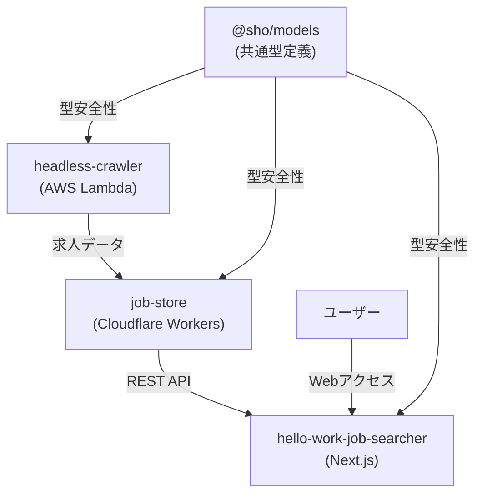

# Hello Work Searcher - ポートフォリオ

## プロジェクト概要

**Hello Work
Searcher**は、ハローワークの求人情報を自動収集・管理・検索できるフルスタックWebアプリケーションです。エンジニア転職活動における求人検索の課題を技術的に解決することを目的として、2ヶ月間（2024年6月〜8月）で開発しました。

**🌐 デモサイト**: https://my-hello-work-job-list-hello-work-j.vercel.app/

### 解決した課題

- **UI/UX問題**: ハローワークサイトの使いにくいインターフェース
- **データ品質**: 求人の重複や情報の不整合
- **検索機能**: 従業員数フィルタリングやキーワード検索の貧弱さ
- **効率性**: 手動での求人チェックに要する時間

## 技術的ハイライト

### アーキテクチャ設計



### 技術スタック

| 領域               | 技術                              | 選定理由                                  |
| ------------------ | --------------------------------- | ----------------------------------------- |
| **フロントエンド** | React 19, Next.js 15, TypeScript  | 最新技術での開発体験向上                  |
| **バックエンド**   | Cloudflare Workers, Hono, D1      | サーバーレス環境での軽量API、コスト最適化 |
| **クローラー**     | AWS Lambda, Playwright, Effect-ts | 重い処理に適したサーバーレス環境          |
| **データベース**   | SQLite (D1), Drizzle ORM          | 型安全なDB操作、軽量な構成                |
| **開発環境**       | pnpm workspace, Biome, TypeScript | モノレポ管理、高速な開発体験              |

## 主要な技術的成果

### 1. 型駆動開発（Type-Driven Development）

**課題**:
フロントエンド〜バックエンド〜データベース間での型の不整合によるランタイムエラー

**解決策**:

- `@sho/models`パッケージによる型定義の一元管理
- Zod + Drizzle ORM + TypeScriptの統合による完全な型安全性
- API仕様とDB schema、フロントエンドの型を自動同期

```typescript
// 型定義の一元管理例
export const jobSelectSchema = z.object({
  jobNumber: z.string().brand<JobNumber>(),
  companyName: z.string(),
  occupation: z.string(),
  // ... 他のフィールド
});

// フロントエンド、バックエンド、DBで同じ型を使用
type Job = z.infer<typeof jobSelectSchema>;
```

**成果**:

- フィールド名のタイポやnull/undefined関連のランタイムエラーを完全に排除
- API仕様変更時の影響範囲を自動検出
- 開発効率の大幅な向上

### 2. Effect-tsによる関数型プログラミング

**課題**: 複雑なスクレイピング処理でのエラーハンドリングと副作用管理

**解決策**: Effect-tsを採用し、従来のPromise/async-awaitから脱却

```typescript
// Effect-tsによるエラーハンドリング例
const scrapingPipeline = pipe(
  navigateToJobPage(jobNumber),
  Effect.flatMap(extractJobDetails),
  Effect.flatMap(validateJobData),
  Effect.catchAll(handleScrapingError),
  Effect.retry(retryPolicy),
);
```

**成果**:

- 複雑な非同期処理を小さな関数に分解
- エラー、結果、依存を全て型で管理
- テスタブルで保守性の高いコード

### 3. サーバーレスアーキテクチャの最適化

**課題**: コスト効率と性能を両立したインフラ設計

**解決策**: 処理特性に応じたプラットフォームの使い分け

- **AWS Lambda**: 重いPlaywright処理、バッチ処理
- **Cloudflare Workers**: 軽量API、低レイテンシでの応答
- **SQS**: 非同期ジョブキューによる処理の分散

**成果**:

- 月額コスト $5以下での運用
- API レスポンス時間の最適化
- スケーラブルな処理能力

### 4. モノレポによる開発効率化

**課題**: 複数パッケージ間での型共有と依存関係管理

**解決策**: pnpm workspaceによるモノレポ構成

```
hello-work-searcher/
├── apps/hello-work-job-searcher/  # フロントエンド
├── packages/
│   ├── models/                    # 共通型定義
│   ├── headless-crawler/          # クローラー
│   ├── job-store/                 # API・DB
│   └── scripts/                   # ユーティリティ
```

**成果**:

- パッケージ間の型共有による開発効率向上
- 統一されたlint・format・テスト環境
- 依存関係の最適化

## 開発で直面した技術的課題と解決

### 1. ヘッドレスクローラーの実装

**課題**: ハローワークサイトのセッション管理とレート制限

**解決プロセス**:

1. **初期アプローチ**: Cloudflareでの軽量パーサー → セッション問題で断念
2. **最終解決**: Playwright + AWS Lambdaでの2段階処理
   - Stage 1: 求人番号一覧の取得
   - Stage 2: SQS経由での個別求人詳細取得

**技術的工夫**:

- ページ遷移前の3秒遅延でレート制限回避
- セッション維持のためのheadless browser活用
- エラー時のリトライ機構（Effect-ts）

### 2. 型安全性の統一

**課題**: Drizzle ORM、Zod、TypeScriptの型定義統一

**具体的問題**:

- データ変換時の型不整合（例: `"2025年7月23日"` → ISO8601形式）
- nullable/optionalの扱いの違い
- 型ブランディングの複雑化

**解決策**:

```typescript
// 段階的型変換の設計
export const RawReceivedDateSchema = z.string()
  .regex(/^\d{4}年\d{1,2}月\d{1,2}日$/)
  .brand("receivedDate(raw)");

export const transformedReceivedDateSchema = RawReceivedDateSchema.transform(
  (value) => {
    const dateStr = value
      .replace("年", "-")
      .replace("月", "-")
      .replace("日", "");
    return new Date(dateStr).toISOString();
  },
).brand<TransformedReceivedDate>();
```

### 3. モノレポのビルド設定

**課題**: workspace間の依存関係とビルド順序の管理

**解決策**:

- tsconfig.jsonの継承構造の最適化
- pnpm workspaceの依存関係設定
- 段階的ビルドプロセスの確立

**具体的な困難点**:

- パッケージ間の循環依存の回避
- 型定義の共有とビルド順序の調整
- 開発時とビルド時の環境差異の解決

## プロジェクトの現状と今後の展望

### 現在の完成度: 60%

**完成済み機能**:

- ✅ 求人データの自動クローリング・スクレイピング
- ✅ 型安全なREST API（OpenAPI仕様書自動生成）
- ✅ JWTベースのページネーション
- ✅ 基本的なWeb UI（デモサイト稼働中）

**開発中機能**:

- 🔄 リッチなフロントエンドUI
- 🔄 高度な検索・フィルタリング機能
- 🔄 レスポンシブデザイン

**今後の計画**:

- 📋 求人データの大規模収集（現在20件 → 1000件以上）
- 📋 ユーザー認証・お気に入り機能
- 📋 求人アラート機能
- 📋 パフォーマンス最適化

## 技術的学習成果

### Effect-tsの習得

**学習の困難さ**: 従来のPromise/async-awaitとは全く異なるパラダイム

**習得後の価値**:

- 副作用の明示的管理
- 型レベルでのエラーハンドリング
- 関数の合成による可読性向上

**学習プロセス**:

- 公式ドキュメントの徹底的な学習
- 小さな機能から段階的に適用
- 従来のPromiseベースのコードとの比較検証

### モダンフロントエンド技術

- React 19の最新機能（Server Components、Suspense）
- Next.js 15 App Routerの活用
- Turbopackによる高速な開発体験

### クラウドネイティブ開発

- AWS CDKによるIaC（Infrastructure as Code）
- Cloudflare Workersでのサーバーレス開発
- サーバーレスアーキテクチャの設計パターン

## 開発環境・品質管理

### 自動化された開発フロー

```bash
# 型チェック
pnpm type-check

# コードフォーマット・lint
pnpm exec biome check --fix

# Git hooks による自動品質チェック
# (Husky + lint-staged)
```

### 継続的品質向上

- **Renovate**: 依存関係の自動更新
- **Biome**: ESLint + Prettierより高速なlint・format
- **TypeScript strict mode**: 全パッケージで厳密な型チェック

## エンジニア面接官へのアピールポイント

### 1. 設計思想の一貫性

- **型駆動開発**: フロントエンド〜バックエンド〜DBまでの完全な型安全性
- **関数型プログラミング**: Effect-tsによる副作用管理と堅牢なエラーハンドリング
- **モジュラー設計**: 疎結合なアーキテクチャによる保守性の確保

### 2. 技術選定の合理性

- **適材適所の技術選択**: 処理特性に応じたプラットフォーム選定
- **最新技術への挑戦**: React 19、Effect-ts等の先進的技術の実践投入
- **コスト意識**: サーバーレスによる運用コスト最適化

### 3. 実践的な問題解決能力

- **実際の課題**: 自身の転職活動で直面した問題を技術で解決
- **段階的改善**: 初期アプローチの失敗から学び、より良い解決策を模索
- **継続的改善**: 現在も機能拡張・最適化を継続中

### 4. 開発プロセスの成熟度

- **品質管理**: 自動化されたlint・format・型チェック
- **ドキュメント**: 詳細な技術仕様書・設計思想の記録
- **保守性**: 将来の機能拡張を見据えた拡張可能な設計

## 技術的な深掘りポイント

### OpenAPI仕様書の自動生成

Chanfanaを使用してHonoベースのAPIからOpenAPI仕様書を自動生成し、フロントエンドとの型整合性を保証：

```typescript
// API定義から自動でOpenAPI仕様書を生成
const openapi = fromHono(app, {
  schema: {
    info: {
      title: "Job Store API",
      version: "1.0.0",
    },
  },
  docs_url: "/api/v1/docs",
});
```

### JWTベースのページネーション

従来のoffset/limitではなく、JWTトークンを使用したセキュアなページネーション機能を実装：

```typescript
// セキュアなページネーション
const paginationToken = await sign(
  {
    exp: Math.floor(Date.now() / 1000) + 60 * 15, // 15分の有効期限
    cursor: { jobId: nextJobId },
  },
  JWT_SECRET,
);
```

## まとめ

Hello Work
Searcherは、実際の課題解決を通じて最新の技術スタックを実践的に学習・適用したプロジェクトです。特に**型安全性の徹底**、**関数型プログラミングの実践**、**サーバーレスアーキテクチャの最適化**において、エンジニアとしての技術力向上を実現しました。

現在も継続的に開発を進めており、より多くの求人データの収集とリッチなユーザー体験の提供を目指しています。

---

**リポジトリ**: https://github.com/shidari/my-hello-work-job-list.git\
**デモサイト**: https://my-hello-work-job-list-hello-work-j.vercel.app/\
**開発期間**: 2024年6月〜8月（2ヶ月間）\
**完成度**: 60%（継続開発中）
