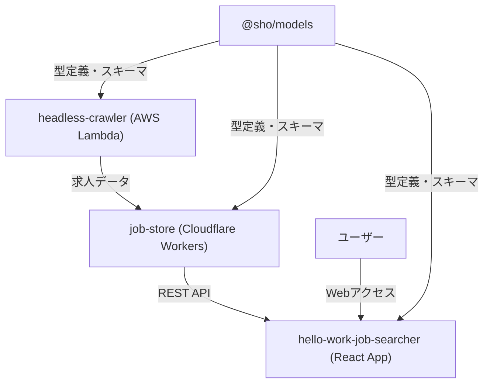

# Hello Work Searcher ポートフォリオ詳細解説

## 🚀 TLDR (斜め読み用サマリー)

**プロジェクト概要**: ハローワーク求人情報の自動収集・管理・検索システム\
**技術スタック**: TypeScript + Effect-ts + AWS Lambda + Cloudflare Workers +
Next.js 15 + React 19\
**アーキテクチャ**: モノレポ型サーバーレス構成（コスト最適化重視）\
**実績**: 約200件の求人データを自動収集・構造化、手動検索プロセスを完全自動化

**技術的ハイライト**:

- **Effect-ts採用の戦略的判断**: Result型への親和性 + 依存注入の型安全性 +
  エフェクトシステムの将来性を見越した先行投資
- **サーバーレス基盤の使い分け**: 理想はCloudflare
  Workers統一だが、headless-browser制約でAWS
  Lambda併用。無料枠内運用でInvocation Alert設定済み
- **型安全性の徹底**: Drizzle ORM + Zod +
  TypeScript統合で存在しないキー指定・型エラーを防止。手動同期の技術的負債は明示的に管理
- **モノレポ効率化**: pnpm workspace + Biome + Husky +
  Renovateによる開発体験最適化

**面接で突っ込まれそうなポイントと回答準備**:

- **Effect-ts学習コスト**:
  確実に高いが、複雑なスクレイピング処理の分解・合成可能設計で投資対効果あり
- **スケーラビリティ**:
  現在200件→10万件対応はLambdaスケール性に依存、ボトルネックは料金面
- **テスト戦略**: カバレッジ低いがREST
  APIエラー検知が課題。E2Eは不要（フロントエンド変動大）
- **監視・運用**: 個人プロジェクトレベルで本格監視未実装、金銭事故防止を最優先

**デモサイト**: https://my-hello-work-job-list-hello-work-j.vercel.app/

---

## 概要

Hello Work
Searcherは、ハローワークの求人情報を自動収集・管理・検索できるモノレポ型Webアプリケーションです。クローラー、API/DB、フロントエンドを独立したパッケージとして構成し、クラウドネイティブな設計・TypeScriptによる型設計を徹底しています。

**実績**:
約200件の求人データを自動収集・構造化し、従来の手動検索プロセスを完全自動化

**技術的ハイライト**:
Effect-tsによる関数型プログラミング、型安全性の徹底、サーバーレスアーキテクチャの最適化、モノレポによる効率的な開発体験を実現。

---

## 作成動機・課題設定

ハローワークでソフトウェアエンジニアの求人検索を行う際に直面した以下の課題を技術的に解決することが目標：

- **UI/UX課題**: 画面が見づらく、検索効率が悪い
- **データ品質課題**: 求人の重複が多すぎる
- **検索機能課題**: 従業員数での絞り込みができない、キーワード検索が貧弱
- **情報取得効率**: 手動での求人チェックに時間がかかりすぎる

**解決アプローチ**:
自動化によるデータ収集、構造化されたデータベース設計、モダンなWeb
UIによる検索体験の向上

---

## システム全体設計図



---

## 技術選定・設計思想

### Effect-ts採用の技術的根拠

**採用理由**:

- **Result型への親和性**:
  もともとResult型を好んでいたため、Effect-tsの型安全なエラーハンドリングが魅力的
- **依存注入の型安全性**:
  依存関係まで型で管理できる点が決定的。headless-crawlerでは`HelloWorkCrawler`を依存として扱い、テスタビリティと保守性を向上
- **エフェクトシステムの将来性**:
  エフェクトシステムは今後メジャーになると予想し、先取りする価値があると判断

**具体的なメリット（実装例）**:

```typescript
// 依存注入による型安全な設計
export class HelloWorkCrawler extends Context.Tag("HelloWorkCrawler")<
  HelloWorkCrawler,
  {
    readonly crawlJobLinks: () => Effect.Effect<
      JobMetadata[],
      | ListJobsError
      | EngineeringLabelSelectorError
    > // ... 全てのエラー型を明示
    ;
  }
>() {}

// Stream.paginateChunkEffectによる効率的なページネーション処理
const stream = Stream.paginateChunkEffect(
  { jobListPage, count: initialCount, roughMaxCount, nextPageDelayMs },
  fetchJobMetaData,
);
```

**学習コストと投資対効果**:

- 学習コストは確実に高いが、習得後のコード整理性・保守性の向上は顕著
- 複雑なスクレイピング処理を小さな関数に分解し、合成可能な設計を実現
- 同期・非同期処理をイテレータベースで統一的に扱える

### サーバーレス基盤の戦略的使い分け

**技術選択の背景**:

- **理想**: 全てCloudflare Workersで統一したかった
- **現実**: headless-browserの制約によりAWS Lambdaが必要に

**具体的な使い分け理由**:

- **AWS Lambda**:
  - Playwrightによるheadless-browser処理（Cloudflare Workersでは不可能）
  - @sparticuz/chromiumによるLambda最適化
  - SQS連携による非同期ジョブ処理
- **Cloudflare Workers**:
  - 軽量なREST API提供
  - エッジでの高速レスポンス
  - D1データベースとの親和性

**コスト戦略**:

- 数値的根拠は現時点で未算出（個人プロジェクトレベル）
- 無料枠内での運用を最優先
- Invocation Alertを設定し、予期しない課金を防止
- 将来的にはECR/EC2への移行も検討（コスト分析後）

**他選択肢との比較**:

- **Vercel Functions**:
  headless-browserサポートが不十分（ChatGPTとの壁打ちで確認）
- **Railway**: 結局有料になる可能性が高く、使い慣れたLambdaを選択

### 型安全性の徹底実装

**Drizzle ORM + Zod + TypeScriptの統合効果**:

- **防げる型エラー**: 存在しないキーの指定、キー値の型保証
- **実際の課題**:
  DrizzleスキーマをそのままZodスキーマとして扱えず、手動でスキーマ作成が必要
- **型整合性の問題**: 手動同期による型の不整合リスク

**具体的な実装例**:

```typescript
// neverthrowによる関数型エラーハンドリング
const result = safeTry(async function* () {
  const validatedData = yield* await ResultAsync.fromPromise(
    self.getValidatedData<typeof self.schema>(),
    (error) =>
      createFetchJobListValidationError(`validation failed\n${String(error)}`),
  );
  // ...
});
```

### モノレポ・開発環境の最適化

- **pnpm workspace**: パッケージ間の型共有・開発効率化
- **Biome**: ESLint + Prettierの代替として高速なlint・format
- **Husky + lint-staged**: コミット時の自動品質チェック
- **Renovate**: 依存関係の自動更新
- **TypeScript strict mode**: 全パッケージで厳密な型安全性を担保

---

## パッケージ詳細

### 1. @sho/models

- **役割**: 全パッケージ共通の型定義・スキーマ管理
- **主な技術**: TypeScript, Zod, Drizzle ORM
- **設計ポイント**:
  - 型の一元管理でパッケージ間の整合性担保
  - Zodによるランタイムバリデーション
  - Drizzle ORMによるDB型定義

#### 型安全性統一の具体的課題解決プロセス

**課題**: Drizzle ORM、Zod、TypeScriptの型定義を統一する際の技術的困難

**遭遇した具体的問題**:

1. **データ変換の型不整合**:
   スクレイピングで取得した生データ（例：`"2025年7月23日"`）をDB保存用（ISO8601形式）に変換する際、各段階で異なる型定義が必要
2. **nullable/optional の不一致**:
   Drizzleの`.nullable()`とZodの`.nullable()`、TypeScriptの`| null`の扱いが微妙に異なる
3. **型ブランディングの複雑化**:
   同じstring型でも`jobNumber`と`companyName`を区別したいが、変換処理で型が失われる

**解決プロセス**:

**Step 1: 型変換の段階的設計**

```typescript
// 生データ → 変換済みデータ → DB保存データの3段階で型を定義
export const RawReceivedDateShema = z.string()
  .regex(/^\d{4}年\d{1,2}月\d{1,2}日$/)
  .brand("receivedDate(raw)");

export const transformedReceivedDateSchema = RawReceivedDateShema
  .transform((value) => {
    const dateStr = value.replace("年", "-").replace("月", "-").replace(
      "日",
      "",
    );
    return new Date(dateStr).toISOString();
  })
  .brand<TransformedReceivedDate>();
```

**Step 2: スキーマ継承による型の一貫性確保**

```typescript
// 基本スキーマから派生させることで型の整合性を保つ
export const insertJobRequestBodySchema = ScrapedJobSchema.omit({
  wage: true,
  receivedDate: true,
  workingHours: true,
  employeeCount: true,
}).extend({
  wageMin: z.number(),
  wageMax: z.number(),
  // ... 変換済みフィールド
});
```

**Step 3: 手動での型同期問題の発見と解決**

- **問題発見**:
  DrizzleスキーマとjobSelectSchemaで手動同期が必要で、フィールド追加時に同期漏れが発生
- **解決策**: コメントで明示的に問題を記録し、将来的な自動生成への移行を計画

```typescript
// これ、キーしか型チェック指定なので、かなりfreaky
export const jobSelectSchema = z.object({
  // Drizzleスキーマと手動同期が必要
});
```

**Step 4: Effect-tsとの統合による堅牢なエラーハンドリング**

```typescript
const validatedReqBody = yield * Effect.tryPromise({
  try: () => self.getValidatedData<typeof self.schema>(),
  catch: (e) =>
    new InsertJobRequestValidationError({
      message: `schema validation failed.\n${String(e)}`,
      errorType: "client",
    }),
}).pipe(Effect.map(({ body }) => body));
```

**成果と学習**:

- **型安全性の向上**:
  フィールド名のタイポやnull/undefined関連のランタイムエラーをコンパイル時に検出
- **開発効率の改善**:
  API仕様変更時の影響範囲が明確化され、修正箇所を漏れなく特定可能
- **保守性の向上**: 型定義の一元管理により、仕様変更時の修正箇所を最小化
- **課題の明確化**: 手動同期部分を明示的にコメントで記録し、技術的負債を可視化

**今後の改善計画**:

- Drizzle-Zodの自動生成ツール導入検討
- 型ブランディングのより効率的な管理手法の研究

### 2. headless-crawler

- **役割**: ハローワーク求人情報の自動クローリング・スクレイピング
- **主な技術**: Playwright, AWS Lambda, AWS CDK, Effect-ts, Jest
- **設計ポイント**:
  - スクレイピング対象の動的ページに対応
  - AWS Lambdaでのスケーラブルなバッチ処理
  - スキーマバリデーションでデータ品質担保
- **技術的課題と解決策**:
  - **セッション管理の問題**:
    最初はCloudflareで軽量なパーサーを使ってクローリングしようとしたが、ハローワークはセッションの関係でfetchができず、headless-browser（Playwright）での実装が必要
  - **2段階処理の実装**:
    クローリングでまず求人番号のみを取得し、SQS経由でスクレイパーを呼び出す設計。セッション維持のため、スクレイピング時も改めてheadless-browserを立ち上げて求人詳細画面まで遷移
  - **レート制限対応**:
    ページングが早すぎるとエラーになるため、ページ遷移前に3秒遅延を実装
  - **Effect-ts chunkの型問題**:
    最も苦労した技術的課題。Effect-tsのchunk処理で型が合わず、ドキュメントを読み返しつつAIとの壁打ちを通じて解決
- **現在の処理能力**:
  約20件の求人データを処理（コスト最適化のため実行頻度を調整）
- **エラーハンドリング**: Effect-tsのリトライAPIを活用予定（現在は未実装）
- **工夫点**:
  - SQS連携による非同期ジョブ投入
  - AWS CDKによるインフラコード管理

### 3. job-store

- **役割**: 求人情報の保存・API提供
- **主な技術**: Cloudflare Workers, Drizzle ORM, Hono, D1(SQLite), Chanfana,
  Effect-ts, Vitest
- **設計ポイント**:
  - サーバーレスで低コスト・高可用性
  - Drizzle ORMで型安全なDB操作
  - Chanfanaによる自動OpenAPI生成でAPI仕様の一元管理
  - HonoによるモダンなWebフレームワーク
- **現状の機能**:
  - 求人情報の保存・取得API
  - JWTベースのページネーション機能
  - RESTful API提供（求人一覧・詳細取得）
  - OpenAPI仕様書自動生成
- **工夫点**:
  - drizzleでDBスキーマの型を持ち、openapiと整合性を常に持たせたかった
  - Cloudflare D1の制約を考慮した設計
  - Effect-tsによる堅牢なエラーハンドリング
  - JWTを使用したセキュアなページネーション実装

### 4. hello-work-job-searcher (apps/)

- **役割**: 求人情報の検索・表示UI
- **主な技術**: Next.js 15, React 19, TanStack Query, TypeScript
- **設計ポイント**:
  - Next.js 15によるフルスタックフレームワーク
  - React Server Components (RSC) の活用
  - React 19の最新機能活用
  - TanStack Queryによる効率的なデータフェッチング
- **技術選択の変遷**:
  - **初期**: TanStack Startを選択（軽量性を重視）
  - **移行理由**: BFF（Backend for
    Frontend）を書く必要が生じたため、RSCで書く方が効率的と判断しNext.jsに移行
  - **移行の利点**: API
    Routesによる統合的な開発体験、RSCによるサーバーサイドでのデータ処理
- **現在の状況**:
  - job-store APIとの連携を実装中
  - 求人検索・表示の基本機能を構築中
- **工夫点**:
  - Job詳細・一覧の再利用可能なコンポーネント設計
  - API Routesを活用したプロキシ実装
  - React 19の最新機能を活用した効率的なUI構築

### 5. scripts

- **役割**: 共通スクリプト・ユーティリティ
- **主な技術**: TypeScript, tsup
- **機能**: スキーマコピー等の開発支援スクリプト

---

## データフロー詳細

1. **クローリング**: headless-crawlerがハローワークWebから求人データを取得
2. **データ送信**: AWS LambdaからCloudflare Workers(job-store)へREST APIで送信
3. **保存**: job-storeがD1(SQLite)にデータを保存
4. **API提供**:
   hello-work-job-searcherがjob-storeのAPIを叩き、求人情報を取得・表示（実装中）

---

## 開発環境・ツールチェーン

### パッケージ管理

- **pnpm workspace**: モノレポ管理、高速インストール
- **依存関係の最適化**: 共通依存関係の重複排除

### 開発ツール

- **Biome**: 高速なlinter・formatter（ESLint + Prettierの代替）
- **Husky + lint-staged**: Git hooks による自動品質チェック
- **TypeScript**: 全パッケージで厳密な型チェック
- **Renovate**: 依存関係の自動更新

### テスト・品質管理

- **Jest**: headless-crawlerのテスト
- **Vitest**: job-storeのテスト
- **型チェック**: 全パッケージでの厳密な型安全性
- **テスト戦略の現状**:
  - 現在はテストカバレッジが低い状態
  - REST APIのモックテストは設定に対する利益が少ないと判断し未実装
  - 型安全性を重視し、コンパイル時チェックに依存

### セキュリティ・運用

- **API認証**: 現在はエンドポイント未公開のため未実装
- **今後の認証戦略**:
  - Rate Limitingの実装
  - フロントエンドからのみアクセス可能なドメイン制限
- **監視・ログ戦略**:
  - ポートフォリオレベルでの軽量な監視
  - GitHub Actionsによる定期的な監視実行を検討

---

## 設計思想・工夫点まとめ

### 型安全性の徹底

- **@sho/models**: 全パッケージ共通の型定義
- **Zod/Chanfana/Drizzle**: スキーマ駆動開発による型の一貫性担保
- **TypeScript strict mode**: 全パッケージで厳密な型チェック

### スケーラビリティ・運用性

- **サーバーレスアーキテクチャ**: AWS Lambda + Cloudflare Workersでコスト最適化
- **インフラコード管理**: AWS CDKによるIaC
- **自動化**: CI/CDパイプライン、依存関係更新の自動化

### 開発体験の向上

- **モノレポ**: パッケージ間の依存管理・型共有
- **モダンツールチェーン**: Biome、Vite、TanStackによる高速開発
- **関数型プログラミング**: Effect-tsによる副作用管理・エラーハンドリング

### 今後の展望

- **フロントエンド完成**: job-store APIとの連携、UI/UX強化
- **機能拡張**: より柔軟な求人検索・フィルタリング機能の追加
- **監視・アラート強化**:
  - 障害発生時の即座な対応を可能にするアラートシステム構築
  - システム全体の健全性監視の充実
- **パフォーマンス最適化**: キャッシュ戦略、レスポンス時間改善
- **技術的挑戦**:
  - Rustによるバックエンド実装（書き味の良さを重視）
  - 将来的にはHaskell + WASM連携による関数型プログラミングの更なる探求

---

## 参考: ディレクトリ構成

```
hello-work-searcher/
├── apps/
│   └── hello-work-job-searcher/ # フロントエンドアプリケーション
├── packages/
│   ├── models/          # 共通スキーマ・型定義
│   ├── headless-crawler/ # ハローワーククローラー
│   ├── job-store/       # 求人情報データベース・API
│   └── scripts/         # 共通スクリプト
├── pnpm-workspace.yaml # モノレポ設定
├── biome.json          # コードフォーマッター設定
├── renovate.json       # 依存関係自動更新設定
└── README.md           # プロジェクト概要
```

---

## 技術的チャレンジ・学習ポイント

### 1. モノレポ設計

- pnpm workspaceによる効率的なパッケージ管理
- 型定義の共有とパッケージ間依存関係の最適化

### 2. サーバーレスアーキテクチャ

- AWS Lambda + Cloudflare Workersのハイブリッド構成
- 各プラットフォームの特性を活かした適材適所の技術選択

### 3. 型安全性の追求

- フロントエンド〜バックエンド〜DBまでの一貫した型管理
- ランタイムバリデーションとコンパイル時型チェックの両立

### 4. モダンフロントエンド

- React 19 + TanStack Startによる最新技術スタックの採用
- ファイルベースルーティングとタイプセーフなナビゲーション

### 5. 関数型プログラミング

- Effect-tsによる副作用管理と堅牢なエラーハンドリング
- 関数型パラダイムによるコードの可読性・保守性向上

---

## 学習・成長の軌跡

### プロジェクトを通じた主要な成長

**Effect-tsエフェクトシステムの習得**:

- このプロジェクトで最も成長したスキル
- 従来のPromise/async-awaitから関数型プログラミングパラダイムへの転換
- エフェクトシステムによる副作用管理と型安全性の両立を実現
- 複雑な非同期処理を小さな関数に分解し、合成可能な設計パターンを習得

### 技術的深化の過程

**型システムの理解深化**:

- Drizzle ORM、Zod、TypeScriptの統合による型安全性の追求
- 型ブランディングによるドメイン固有の型設計
- ランタイムバリデーションとコンパイル時型チェックの使い分け

**サーバーレスアーキテクチャの実践**:

- AWS Lambda + Cloudflare Workersのハイブリッド構成による適材適所の技術選択
- コスト最適化とパフォーマンスのバランス設計
- インフラコード（AWS CDK）による運用自動化

### 次なる技術的挑戦

**関数型プログラミングの更なる探求**:

- Rustによるバックエンド実装への挑戦（書き味の良さを重視）
- 将来的なHaskell + WASM連携による純粋関数型プログラミングの実践
- より堅牢で表現力豊かなシステム設計の追求
