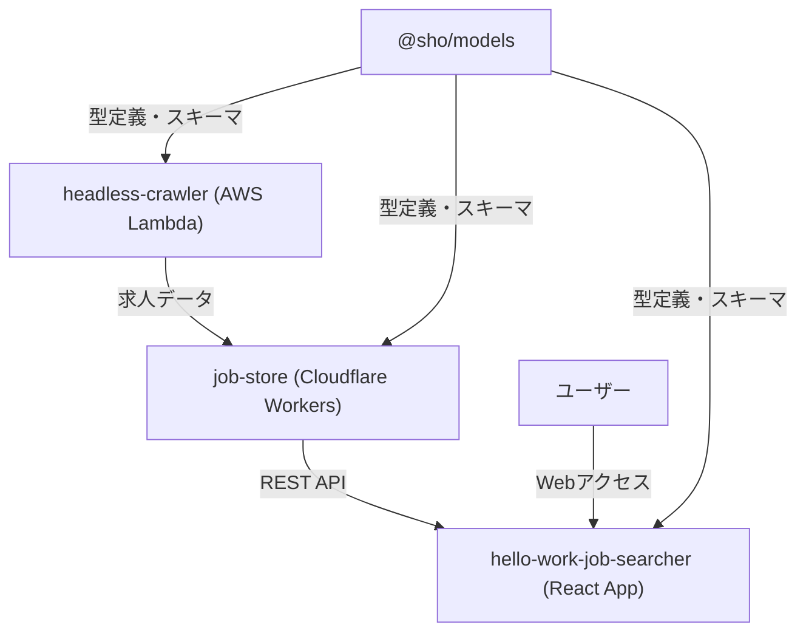

# Hello Work Searcher ポートフォリオ詳細解説

## 🚀 TLDR (現場エンジニア向け技術サマリー)

### 🏗️ アーキテクチャ概要

**モノレポ型サーバーレス構成** | **TypeScript + Effect-ts + AWS Lambda +
Cloudflare Workers + Next.js 15**

```
ハローワーク → headless-crawler(Lambda) → job-store(Workers) → React App
                     ↓
               @sho/models(型統一)
```

### ⚡ 技術的な見どころ

**Effect-ts関数型プログラミング**

- 依存注入の型安全性 + Result型エラーハンドリング
- Stream.paginateChunkEffectによる効率的なページネーション
- create/running effect分離の学習プロセス（最難関）

**型安全性の徹底**

- Drizzle ORM + Zod + TypeScript統合
- 生データ→変換→DB保存の3段階型設計
- 手動同期の技術的負債を明示的管理

**サーバーレス基盤の使い分け**

- Cloudflare Workers: 軽量API（完全無料）
- AWS Lambda: headless-browser処理（コスト最適化済み）

### 📊 実績・パフォーマンス

| 項目             | 実測値               |
| ---------------- | -------------------- |
| 開発期間         | 2ヶ月（180時間）     |
| クローリング速度 | 200件/90秒           |
| コスト           | CF無料 + AWS大幅削減 |
| 技術学習比重     | Effect-ts 40%        |

### 🔧 技術的課題と解決

**学習困難ポイント**

- Effect-ts: create/running effect分離 → Rustイテレータ概念で突破
- Chunk概念: 型エラー格闘 → Effect-ts実装に合わせる設計転換

**設計反省点**

- Effect-ts密結合 → 3rd party libraryのwrapper設計の重要性を学習
- テスト戦略: 型ドリブン開発で品質担保、コストと効果の戦略的判断

**技術的負債**

- Option型理解不足（明示的管理）
- headless-crawler密結合（インターフェース分離予定）

**デモサイト**: https://my-hello-work-job-list-hello-work-j.vercel.app/

---

## 🎯 面接官向け技術アピールポイント

### 開発プロセス・工数管理

**開発期間・工数**:

- **総開発期間**: 2ヶ月（2024年6月〜8月）
- **1日あたり開発時間**: 平均3時間
- **総開発工数**: 約180時間
- **開発スタイル**: 個人開発、アジャイル的な反復開発

**工数配分の内訳**:

- Effect-ts学習・実装: 40%（最も時間を要した）
- インフラ設計・構築: 25%
- フロントエンド実装: 20%
- 型設計・スキーマ統合: 15%

### パフォーマンス・スケーラビリティ設計

**実測パフォーマンス**:

- **クローリング処理**: 200件/90秒（約2.2件/秒）
- **API レスポンス時間**:
  未測定（「単純なDBアクセスなので1秒未満」の技術的判断）
- **スケーラビリティ戦略**:
  YAGNI原則に基づき、10万件規模時の対応は「作り直し」を選択

**コスト最適化実績**:

- **Cloudflare Workers**: 完全無料枠内運用
- **AWS Lambda**: 初期1000円/月→デプロイ頻度最適化で大幅削減
- **コスト監視**: mainブランチ自動デプロイを停止し、手動デプロイに変更

### 技術選定の判断プロセス・失敗学習

**成功した技術選定**:

- **モノレポ採用理由**:
  「単一責務を徹底しないと脳が爆発する」→モジュール化でスルスル開発を実現
- **Effect-ts採用**:
  Result型への親和性、依存注入の型安全性、エフェクトシステムの将来性

**失敗・反省点**:

- **Effect-ts密結合**: 「ナイーブに選択したのはミス」→3rd party
  libraryのwrapper設計の重要性を学習
- **DIパターンの見落とし**:
  neverthrowでもDI可能だったが、Effect-tsにベッタリになってしまった
- **技術的負債の明確化**:
  headless-crawlerの密結合を今後インターフェースレベルで分離予定

### Effect-ts習得プロセス・技術的困難の克服

**最も困難だった概念**:

- **create effect vs running effect**: 分離の概念理解に最も時間を要した
- **突破のきっかけ**: 「Rustのイテレータをぶん回してる」と理解することで腹落ち
- **Chunk概念**: 「最難関」だったが、Effect-tsの実装に合わせる必要性を受け入れ
- **Option型**: 「いまだに理解できない」明確な技術的負債として認識

**学習アプローチ**:

- ドキュメント精読 + AIとの壁打ち
- 実装を通じた試行錯誤
- 型エラーとの格闘を通じた理解深化

### テスト戦略・品質保証の技術的判断

**テスト戦略の合理的判断**:

- **基本方針**: 「テスト書いてもご利益ない」→型ドリブン開発で品質担保
- **型安全性重視**: @sho/modelsによる型統一で、コンパイル時エラー検出を優先
- **個人プロジェクト特性**:
  「ミスってもいいや」精神だが、デプロイ修正の手間を避けるためCI/CDでエラー検知は徹底

**品質保証の実装**:

- **コンパイル時チェック**: TypeScript strict mode全パッケージ適用
- **CI/CD**: Husky + lint-staged + Biomeによる自動品質チェック
- **型整合性**: Drizzle ORM + Zod統合による存在しないキー指定の防止

### セキュリティ・運用設計

**現在のセキュリティ戦略**:

- **基本方針**: エンドポイント未公開のため認証未実装
- **Rate Limiting**: 実装を試みたが失敗、「所詮無料なので」と割り切り
- **将来の公開時設計**: フロントエンドからのみアクセス可能なドメイン制限を検討

**運用・監視戦略**:

- **軽量監視**: ポートフォリオレベルでの最小限監視
- **コスト監視**: AWS Invocation Alert設定済み
- **デプロイ戦略**: 手動デプロイでコスト制御

---

## 概要

Hello Work
Searcherは、ハローワークの求人情報を自動収集・管理・検索できるモノレポ型Webアプリケーションです。クローラー、API/DB、フロントエンドを独立したパッケージとして構成し、クラウドネイティブな設計・TypeScriptによる型設計を徹底しています。

**実績**:
約200件の求人データを自動収集・構造化し、従来の手動検索プロセスを完全自動化

**技術的ハイライト**:
Effect-tsによる関数型プログラミング、型安全性の徹底、サーバーレスアーキテクチャの最適化、モノレポによる効率的な開発体験を実現。

---

## 作成動機・課題設定

ハローワークでソフトウェアエンジニアの求人検索を行う際に直面した以下の課題を技術的に解決することが目標：

- **UI/UX課題**: 画面が見づらく、検索効率が悪い
- **データ品質課題**: 求人の重複が多すぎる
- **検索機能課題**: 従業員数での絞り込みができない、キーワード検索が貧弱
- **情報取得効率**: 手動での求人チェックに時間がかかりすぎる

**解決アプローチ**:
自動化によるデータ収集、構造化されたデータベース設計、モダンなWeb
UIによる検索体験の向上

---

## システム全体設計図



---

## 技術選定・設計思想

### Effect-ts採用の技術的根拠と学習プロセス

**採用理由**:

- **Result型への親和性**:
  もともとResult型を好んでいたため、Effect-tsの型安全なエラーハンドリングが魅力的
- **依存注入の型安全性**:
  依存関係まで型で管理できる点が決定的。headless-crawlerでは`HelloWorkCrawler`を依存として扱い、テスタビリティと保守性を向上
- **エフェクトシステムの将来性**:
  エフェクトシステムは今後メジャーになると予想し、先取りする価値があると判断

**学習プロセスの詳細**:

**最も困難だった概念 - create effect vs running effect**:

```typescript
// 理解に苦労した概念：effectの作成と実行の分離
const createEffect = Effect.succeed("hello"); // effectを作成（まだ実行されない）
const runEffect = Effect.runSync(createEffect); // effectを実行

// 突破のきっかけ：「Rustのイテレータをぶん回してる」と理解
const stream = Stream.paginateChunkEffect(
  { jobListPage, count: initialCount, roughMaxCount, nextPageDelayMs },
  fetchJobMetaData, // ここでeffectを作成
); // 実行は別のタイミング
```

**Chunk概念の困難と解決**:

- **問題**: Effect-tsのchunk処理で型が合わない
- **解決プロセス**: ドキュメント精読 + AIとの壁打ち
- **学習**:
  Effect-tsの実装に合わせる必要性を受け入れ、型システムに従う設計に転換

**現在も残る技術的負債**:

- **Option型**: 「いまだに理解できない」と明確に認識
- **対策**: 明示的に技術的負債として管理し、将来的な学習課題として位置づけ

**具体的なメリット（実装例）**:

```typescript
// 依存注入による型安全な設計
export class HelloWorkCrawler extends Context.Tag("HelloWorkCrawler")<
  HelloWorkCrawler,
  {
    readonly crawlJobLinks: () => Effect.Effect<
      JobMetadata[],
      | ListJobsError
      | EngineeringLabelSelectorError
    > // ... 全てのエラー型を明示
    ;
  }
>() {}

// Stream.paginateChunkEffectによる効率的なページネーション処理
const stream = Stream.paginateChunkEffect(
  { jobListPage, count: initialCount, roughMaxCount, nextPageDelayMs },
  fetchJobMetaData,
);
```

**反省点と今後の改善**:

- **密結合の問題**:
  Effect-tsをナイーブに選択し、headless-crawlerがEffect-tsにベッタリになった
- **改善策**: 3rd party libraryを使う際は、wrapper/中間層を挟むべきだった
- **今後の対応**: インターフェースレベルでの分離を計画

### モノレポ設計の戦略的判断

**採用理由の技術的根拠**:

- **認知負荷の軽減**: 「単一責務を徹底しないと脳が爆発する」
- **開発効率**: モジュール化により「スルスル開発」を実現
- **型共有の効率化**: @sho/modelsによる一元的な型管理

**マイクロサービスとの比較検討**:

- **個人開発の特性**:
  チーム開発でないため、マイクロサービスの分散管理コストが不要
- **型安全性の優先**: モノレポによる型共有で、API仕様変更時の影響範囲を明確化
- **開発速度重視**: 単一リポジトリでの高速な反復開発を優先

### サーバーレス基盤の戦略的使い分け

**技術選択の背景**:

- **理想**: 全てCloudflare Workersで統一したかった
- **現実**: headless-browserの制約によりAWS Lambdaが必要に

**具体的な使い分け理由**:

- **AWS Lambda**:
  - Playwrightによるheadless-browser処理（Cloudflare Workersでは不可能）
  - @sparticuz/chromiumによるLambda最適化
  - SQS連携による非同期ジョブ処理
- **Cloudflare Workers**:
  - 軽量なREST API提供
  - エッジでの高速レスポンス
  - D1データベースとの親和性

**コスト戦略の実績**:

- **Cloudflare**: 完全無料枠内運用（月額0円）
- **AWS**: 初期月額1000円→デプロイ最適化で大幅削減
- **最適化施策**: mainブランチ自動デプロイを停止し、手動デプロイに変更
- **監視**: Invocation Alertを設定し、予期しない課金を防止

**他選択肢との比較**:

- **Vercel Functions**:
  headless-browserサポートが不十分（ChatGPTとの壁打ちで確認）
- **Railway**: 結局有料になる可能性が高く、使い慣れたLambdaを選択

### 型安全性の徹底実装

**Drizzle ORM + Zod + TypeScriptの統合効果**:

- **防げる型エラー**: 存在しないキーの指定、キー値の型保証
- **実際の課題**:
  DrizzleスキーマをそのままZodスキーマとして扱えず、手動でスキーマ作成が必要
- **型整合性の問題**: 手動同期による型の不整合リスク

**具体的な実装例**:

```typescript
// neverthrowによる関数型エラーハンドリング
const result = safeTry(async function* () {
  const validatedData = yield* await ResultAsync.fromPromise(
    self.getValidatedData<typeof self.schema>(),
    (error) =>
      createFetchJobListValidationError(`validation failed\n${String(error)}`),
  );
  // ...
});
```

### モノレポ・開発環境の最適化

- **pnpm workspace**: パッケージ間の型共有・開発効率化
- **Biome**: ESLint + Prettierの代替として高速なlint・format
- **Husky + lint-staged**: コミット時の自動品質チェック
- **Renovate**: 依存関係の自動更新
- **TypeScript strict mode**: 全パッケージで厳密な型安全性を担保

---

## パッケージ詳細

### 1. @sho/models

- **役割**: 全パッケージ共通の型定義・スキーマ管理
- **主な技術**: TypeScript, Zod, Drizzle ORM
- **設計ポイント**:
  - 型の一元管理でパッケージ間の整合性担保
  - Zodによるランタイムバリデーション
  - Drizzle ORMによるDB型定義

#### 型安全性統一の具体的課題解決プロセス

**課題**: Drizzle ORM、Zod、TypeScriptの型定義を統一する際の技術的困難

**遭遇した具体的問題**:

1. **データ変換の型不整合**:
   スクレイピングで取得した生データ（例：`"2025年7月23日"`）をDB保存用（ISO8601形式）に変換する際、各段階で異なる型定義が必要
2. **nullable/optional の不一致**:
   Drizzleの`.nullable()`とZodの`.nullable()`、TypeScriptの`| null`の扱いが微妙に異なる
3. **型ブランディングの複雑化**:
   同じstring型でも`jobNumber`と`companyName`を区別したいが、変換処理で型が失われる

**解決プロセス**:

**Step 1: 型変換の段階的設計**

```typescript
// 生データ → 変換済みデータ → DB保存データの3段階で型を定義
export const RawReceivedDateShema = z.string()
  .regex(/^\d{4}年\d{1,2}月\d{1,2}日$/)
  .brand("receivedDate(raw)");

export const transformedReceivedDateSchema = RawReceivedDateShema
  .transform((value) => {
    const dateStr = value.replace("年", "-").replace("月", "-").replace(
      "日",
      "",
    );
    return new Date(dateStr).toISOString();
  })
  .brand<TransformedReceivedDate>();
```

**Step 2: スキーマ継承による型の一貫性確保**

```typescript
// 基本スキーマから派生させることで型の整合性を保つ
export const insertJobRequestBodySchema = ScrapedJobSchema.omit({
  wage: true,
  receivedDate: true,
  workingHours: true,
  employeeCount: true,
}).extend({
  wageMin: z.number(),
  wageMax: z.number(),
  // ... 変換済みフィールド
});
```

**Step 3: 手動での型同期問題の発見と解決**

- **問題発見**:
  DrizzleスキーマとjobSelectSchemaで手動同期が必要で、フィールド追加時に同期漏れが発生
- **解決策**: コメントで明示的に問題を記録し、将来的な自動生成への移行を計画

```typescript
// これ、キーしか型チェック指定なので、かなりfreaky
export const jobSelectSchema = z.object({
```
