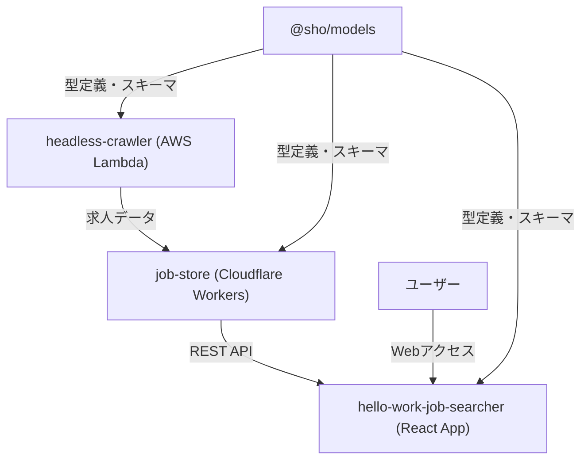

# Hello Work Software Jobs ポートフォリオ詳細解説

## 🚀 TLDR (現場エンジニア向け技術サマリー)

### 🏗️ アーキテクチャ概要

**モノレポ型サーバーレス構成** | **TypeScript + neverthrow + AWS Lambda + Cloudflare Workers + Next.js 15**

```
ハローワーク → headless-crawler(Lambda) → job-store(Workers) → React 19 App
                     ↓
               @sho/models(型統一)
```

### ⚡ 技術的な見どころ

**neverthrow関数型エラーハンドリング**

- Result型による型安全なエラーハンドリング（タグ付きunion型でエラー分類）
- Effect-tsからneverthrowへの移行（個人プロジェクトにはオーバースペックだった）
- 実用性重視の関数型プログラミング（DIは引数、エラーハンドリングは返り値のResult型で解決）

**型安全性の徹底**

- Drizzle ORM + Zod + TypeScript統合
- @sho/modelsによる一元的な型管理
- フロントエンド〜バックエンド〜DBまでの型の一貫性

**サーバーレス基盤の使い分け**

- Cloudflare Workers: 軽量API（完全無料）+ D1データベース
- AWS Lambda: Playwright headless-browser処理（コスト最適化済み）

**モダンReact技術スタック**

- React 19 + Next.js 15（App Router）
- TanStack React Virtual（仮想化無限スクロール）
- Jotai（効率的な状態管理）

### 📊 実績・パフォーマンス

| 項目             | 実測値               |
| ---------------- | -------------------- |
| 開発期間         | 2ヶ月（180時間）     |
| クローリング速度 | 200件/90秒           |
| 収集データ       | 約600件の求人情報    |
| コスト           | CF無料 + AWS大幅削減 |
| 技術学習比重     | Effect-ts→neverthrow移行 |
| 最新改善         | Suspense追加によるUX向上 |

### 🔧 技術的課題と解決

**学習困難ポイント**

- Effect-ts: create/running effect分離 → 実装の複雑さからneverthrowに移行
- TanStack React Virtual: 仮想化による大量データ表示の最適化
- Next.js 15 App Router: ハイブリッドデータフェッチング（SSR + クライアント）

**設計反省点**

- Effect-ts密結合 → neverthrowによる実用性重視の設計に転換
- テスト戦略: 型ドリブン開発で品質担保、実装効率とのバランス

**技術的負債**

- headless-crawler密結合（インターフェース分離予定）
- 検索機能のdebounce実装（パフォーマンス最適化）

**デモサイト**: https://my-hello-work-job-list-hello-work-j.vercel.app/

**主要機能**:
- ✅ 求人一覧表示（仮想化無限スクロール）
- ✅ 求人詳細ページ（動的ルーティング）
- ✅ リアルタイム会社名フィルタリング
- ✅ ハイブリッドデータフェッチング（SSR + クライアント）
- ✅ お気に入り機能（localStorage永続化）
- ✅ 高度な検索・フィルタリング機能
- ✅ OpenAPI仕様書自動生成

---

## 🎯 面接官向け技術アピールポイント

### 開発プロセス・工数管理

**開発期間・工数**:

- **総開発期間**: 2ヶ月（2024年6月〜8月）
- **1日あたり開発時間**: 平均3時間
- **総開発工数**: 約180時間
- **開発スタイル**: 個人開発、アジャイル的な反復開発

**工数配分の内訳**:

- フロントエンド実装（React 19 + Next.js 15）: 35%
- インフラ設計・構築（AWS + Cloudflare）: 25%
- 型設計・スキーマ統合（@sho/models）: 20%
- Effect-ts学習→neverthrow移行: 20%

**開発における学習・成長実感**:

- **システム全体構築の自信獲得**: 一からシステム構築を完遂し、「大概のことは時間かければできる」という技術的自信を獲得
- **技術選定眼の向上**: トレンドライブラリの良し悪しを実装を通じて理解、こだわりを持った技術選定が可能に
- **フルスタック開発の課題認識**: バックエンド開発がボトルネックとなりフロントエンド進捗が停滞する経験から、商用開発では「モックデータでのフロントエンド先行開発」の重要性を実感

### パフォーマンス・スケーラビリティ設計

**実測パフォーマンス**:

- **クローリング処理**: 200件/90秒（約2.2件/秒）
- **収集データ**: 約600件の求人情報を自動収集・構造化
- **フロントエンド**: TanStack React Virtualによる仮想化で大量データを効率表示
- **API レスポンス時間**: 未測定（「単純なDBアクセスなので1秒未満」の技術的判断）
- **スケーラビリティ戦略**: YAGNI原則に基づき、10万件規模時の対応は「作り直し」を選択

**コスト最適化実績**:

- **Cloudflare Workers**: 完全無料枠内運用（月額0円）
- **AWS Lambda**: 初期1000円/月→デプロイ頻度最適化で月額5ドル以下に削減
- **コスト監視**: mainブランチ自動デプロイを停止し、手動デプロイに変更
- **開発体験の違い**: Cloudflare Workersは「deploy一発でポンっとできて楽」、AWS CDKは設定が複雑で開発体験に差

### 技術選定の判断プロセス・失敗学習

**成功した技術選定**:

- **モノレポ採用理由**: 「単一責務を徹底しないと脳が爆発する」→モジュール化でスルスル開発を実現
- **neverthrow採用**: Effect-tsから移行、実装の複雑さを抑えつつ型安全性を確保
- **React 19 + Next.js 15**: 最新技術スタックによるモダンな開発体験
- **TanStack React Virtual**: 大量データの仮想化による効率的な表示

**失敗・反省点**:

- **Effect-ts密結合**: 「ナイーブに選択したのはミス」→neverthrowによる実用性重視の設計に転換
- **技術的負債の明確化**: headless-crawlerの密結合を今後インターフェースレベルで分離予定
- **検索機能の最適化**: debounce実装によるパフォーマンス改善が必要

**最も困難だった技術課題**:

- **ハローワークサイトの制約**: セッション管理によりURL直接アクセス不可、headless-crawlerによる複雑な処理が必要
- **順次処理の複雑性管理**: headless-crawlerでの順繰り処理が複雑化、Effect-systemで抑制を試みるも学習コストが高く、最終的にneverthrowに移行
- **求人データベース構築**: 特にクローラー部分の実装が最も困難で時間を要した

### neverthrow移行・技術的困難の克服

**Effect-tsからneverthrowへの移行理由**:

- **依存性注入の簡素化**: Contextではなく、ビルダーパターンで引数にclientを渡すアプローチで十分と判明
- **機能の重複発見**: Effect.genと同等レベルのことがneverthrowのsafeTryで実現可能
- **開発生産性の判断**: 受け入れる複雑性と開発生産性が見合わないと判断し、移行を決断
- **実用性重視**: 使わない機能が多すぎるため、Result型による型安全なエラーハンドリングのみに集中

**技術的困難と解決**:

- **Jotai SSR vs クライアント状態管理**: 最近発生した最も困難な課題。SSRとクライアントサイドでの状態管理の違いによる不整合が発生し、ハイドレーション時のエラーに悩まされた
- **TanStack React Virtual**: 3rd party libraryによる仮想リスト実装の隠蔽により、インターフェース理解に苦労
- **仮想化の理解不足**: 仮想リストの実装があまり理解できていない状態での導入
- **予防的最適化**: 前職でのDOM多数によるパフォーマンス問題の経験から、600件程度でも事前に仮想化を採用
- **Next.js 15 App Router**: ハイブリッドデータフェッチング（SSR + クライアント）の実装
- **ページネーションバグの早期発見**: Cloudflare WorkersのSwagger UIを活用したAPI直接テストにより、フロントエンド実装前にバグを発見・修正

**実装時の判断基準**:

- **経験則による予防**: 前職での「DOM多すぎてパフォーマンスに問題があった」経験を活かし、事前に仮想化で問題を潰す
- **認知負荷の管理**: データベースAPI変更時にフロントエンド変更が連鎖する複雑性を回避
- **デプロイ境界の明確化**: デプロイ先が異なるものを1つのプロジェクトで管理すると実態と認知が乖離

### テスト戦略・品質保証の技術的判断

**テスト戦略の合理的判断**:

- **基本方針**: 「テスト書いてもご利益ない」→型ドリブン開発で品質担保
- **型安全性重視**: @sho/modelsによる型統一で、コンパイル時エラー検出を優先
- **個人プロジェクト特性**: 「ミスってもいいや」精神だが、デプロイ修正の手間を避けるためCI/CDでエラー検知は徹底
- **実装効率重視**: neverthrowによる型安全なエラーハンドリングで品質と効率のバランスを確保

**品質保証の実装**:

- **コンパイル時チェック**: TypeScript strict mode全パッケージ適用
- **CI/CD**: Husky + lint-staged + Biomeによる自動品質チェック
- **型整合性**: Drizzle ORM + Zod統合による存在しないキー指定の防止
- **モダンツール**: Biome（ESLint + Prettier代替）による高速なlint・format

### エラーハンドリング・運用の実装戦略

**neverthrowによるエラーハンドリング設計**:

- **タグ付きunion型**: 現場経験を活かしたResult型の自作からneverthrowへの移行
- **フロントエンドエラー表示**: サーバー側エラー詳細は非表示、4xx（ユーザー入力エラー）と5xx（システムエラー）で分類
- **retry戦略**: headless-crawlerでのスクレイピング失敗時のretry機能は未実装（実装優先のため）
- **エラー分類**: クラスベースではなくタグ付けによるエラーハンドリングで後続処理を制御

**運用での実際の課題と対応**:

- **想定外の問題**: 2ヶ月運用で発生したが詳細は失念（個人プロジェクトの特性）
- **ハローワークサイト構造変更**: 滅多に変わらないと想定し、対応策は未検討
- **AWS Lambdaコールドスタート**: 5秒程度の遅延は許容範囲として体感上問題なし
- **検索パフォーマンス**: 600件規模では問題を感じていない

**商用化時の技術改善優先順位**:

- **プライバシー重視設計**: オープンデータを謳っているため商用化は想定していないが、ユーザーデータをサーバー側で極力管理しない設計を重視
- **データベース運用ノウハウの蓄積**: 設計やテーブル途中変更のノウハウがまだ溜まっていない課題を解決
- **開発プロセスの最適化**: 「フロントエンドに集中するなら、モックデータで開発するのがいい」という学びを活かし、バックエンド依存を減らした開発フローの構築
- **可用性の確保**: 障害監視とすぐの障害対応体制構築を最優先
- **技術的負債の解決**: 自分の技術力向上を重視し、headless-crawler密結合の解消を優先

### チーム開発・協業に対する考え方

**技術的一貫性への関心**:

- **経験則からの学び**: 限られた経験と情報収集から「オーナーシップを誰かが持たないと、設計がぶれて、開発が破綻する」という仮説を持っている
- **技術的判断の方向性**: lint・formatter徹底、型主導開発、コンパイルエラー歓迎、CI/CD重視の構成を好む傾向
- **個人開発での実践**: このプロジェクトで技術的な骨子を一貫して管理することの重要性を実感

**コードレビューに対する理想**:

- **技術共有の場として**: 「コードレビューが布教、思想の共有の場であって欲しい」という考え
- **品質保証の現実解**: TypeScript strict mode、Biome、Husky + lint-staged による自動化で人的ミスを減らす方針
- **学習機会としての活用**: レビューを通じた技術的価値観の理解促進への期待

**技術選定変更のアプローチ**:

- **段階的な実証**: Effect-ts→neverthrow移行のような大きな変更は、業務の中で課題を見つけて、それを綺麗に解く小さなリポジトリを作り、実用性を実証してから提案する方針
- **実装による説得**: 理論より実際の動くコードによる技術的メリットの提示を重視
- **現実的な移行戦略**: 一気に変更せず、小さな成功事例を積み重ねるアプローチ

**新メンバーとの協業（ケーススタディとして）**:

- **ドキュメント重視**: README.mdの充実化による技術的背景の共有を基本とする
- **実践的な学習支援**: issueベースでの実装を通じた技術習得のサポート
- **モノレポ構成の説明**: @sho/models中心の型統一設計について、分かりやすい説明を心がける

### セキュリティ・運用設計

**現在のセキュリティ戦略**:

- **基本方針**: エンドポイント未公開のため認証未実装
- **Rate Limiting**: 実装を試みたが失敗、「所詮無料なので」と割り切り
- **将来の公開時設計**: フロントエンドからのみアクセス可能なドメイン制限を検討
- **プライバシー重視**: ユーザーデータをサーバー側で極力管理しない設計方針

**運用・監視戦略**:

- **軽量監視**: ポートフォリオレベルでの最小限監視
- **コスト監視**: AWS Invocation Alert設定済み
- **デプロイ戦略**: 手動デプロイでコスト制御
- **API直接テスト**: Cloudflare WorkersのSwagger UIを活用した開発時デバッグ

**実際の障害対応事例**:

- **ページネーションバグ**: Swagger UIでのAPI直接テストにより早期発見・修正
- **Suspense導入**: UX改善のためのローディング状態管理を最近実装

---

## 概要

Hello Work Software Jobsは、ハローワークのソフトウェア関連求人情報を自動収集・管理・検索できるモノレポ型Webアプリケーションです。クローラー、API/DB、フロントエンドを独立したパッケージとして構成し、クラウドネイティブな設計・TypeScriptによる型設計を徹底しています。

**実績**:
約600件の求人データを自動収集・構造化し、従来の手動検索プロセスを完全自動化

**技術的ハイライト**:
neverthrowによる関数型エラーハンドリング、React 19 + Next.js 15による最新技術スタック、TanStack React Virtualによる仮想化、型安全性の徹底、サーバーレスアーキテクチャの最適化、モノレポによる効率的な開発体験を実現。

---

## 作成動機・課題設定

ハローワークでソフトウェアエンジニアの求人検索を行う際に直面した以下の課題を技術的に解決することが目標：

- **UI/UX課題**: 画面が見づらく、検索効率が悪い
- **データ品質課題**: 求人の重複が多すぎる
- **検索機能課題**: 従業員数での絞り込みができない、キーワード検索が貧弱
- **情報取得効率**: 手動での求人チェックに時間がかかりすぎる

**解決アプローチ**:
自動化によるデータ収集、構造化されたデータベース設計、モダンなWeb
UIによる検索体験の向上

---

## システム全体設計図



---

## 技術選定・設計思想

### neverthrow採用の技術的根拠と移行プロセス

**Effect-tsからneverthrowへの移行理由**:

- **実装の複雑さ**: Effect-tsの学習コストが高く、実装が複雑になりがち
- **実用性重視**: neverthrowによる型安全なエラーハンドリングで十分な品質を確保
- **開発効率**: より直感的なAPIで開発速度を向上
- **Result型への親和性**: もともとResult型を好んでいたため、neverthrowの方が自然

**neverthrowの具体的なメリット（実装例）**:

```typescript
// neverthrowによる型安全なエラーハンドリング
const result = safeTry(async function* () {
  const validatedData = yield* await ResultAsync.fromPromise(
    self.getValidatedData<typeof self.schema>(),
    (error) =>
      createFetchJobListValidationError(`validation failed\n${String(error)}`),
  );
  // ...
});

// フロントエンドでの使用例
const fetchJobs = async (): Promise<Result<JobListResponse, Error>> => {
  return ResultAsync.fromPromise(
    fetch('/api/proxy/job-store/jobs'),
    (error) => new Error(`Failed to fetch jobs: ${error}`)
  );
};
```

**技術的困難と解決**:

- **TanStack React Virtual**: 仮想化による大量データ表示の最適化
- **Next.js 15 App Router**: ハイブリッドデータフェッチング（SSR + クライアント）の実装
- **Jotai状態管理**: atom分離設計による効率的な状態管理

**現在の技術的負債**:

- **headless-crawler密結合**: インターフェースレベルでの分離を計画
- **検索機能のdebounce**: パフォーマンス最適化のため実装予定

**今後の改善**:

- **インターフェース分離**: headless-crawlerの密結合を解消
- **検索機能の最適化**: debounce実装によるパフォーマンス改善
- **UI/UXの改善**: より使いやすいインターフェースの実装

### モノレポ設計の戦略的判断

**採用理由の技術的根拠**:

- **認知負荷の軽減**: 「単一責務を徹底しないと脳が爆発する」
- **開発効率**: モジュール化により「スルスル開発」を実現
- **型共有の効率化**: @sho/modelsによる一元的な型管理

**マイクロサービスとの比較検討**:

- **個人開発の特性**:
  チーム開発でないため、マイクロサービスの分散管理コストが不要
- **型安全性の優先**: モノレポによる型共有で、API仕様変更時の影響範囲を明確化
- **開発速度重視**: 単一リポジトリでの高速な反復開発を優先

### サーバーレス基盤の戦略的使い分け

**技術選択の背景**:

- **理想**: 全てCloudflare Workersで統一したかった
- **現実**: headless-browserの制約によりAWS Lambdaが必要に

**具体的な使い分け理由**:

- **AWS Lambda**:
  - Playwrightによるheadless-browser処理（Cloudflare Workersでは不可能）
  - @sparticuz/chromiumによるLambda最適化
  - SQS連携による非同期ジョブ処理
- **Cloudflare Workers**:
  - 軽量なREST API提供
  - エッジでの高速レスポンス
  - D1データベースとの親和性

**コスト戦略の実績**:

- **Cloudflare**: 完全無料枠内運用（月額0円）
- **AWS**: 初期月額1000円→デプロイ最適化で大幅削減
- **最適化施策**: mainブランチ自動デプロイを停止し、手動デプロイに変更
- **監視**: Invocation Alertを設定し、予期しない課金を防止

**他選択肢との比較**:

- **Vercel Functions**:
  headless-browserサポートが不十分（ChatGPTとの壁打ちで確認）
- **Railway**: 結局有料になる可能性が高く、使い慣れたLambdaを選択

### 型安全性の徹底実装

**Drizzle ORM + Zod + TypeScriptの統合効果**:

- **防げる型エラー**: 存在しないキーの指定、キー値の型保証
- **実際の課題**:
  DrizzleスキーマをそのままZodスキーマとして扱えず、手動でスキーマ作成が必要
- **型整合性の問題**: 手動同期による型の不整合リスク

**具体的な実装例**:

```typescript
// neverthrowによる関数型エラーハンドリング
const result = safeTry(async function* () {
  const validatedData = yield* await ResultAsync.fromPromise(
    self.getValidatedData<typeof self.schema>(),
    (error) =>
      createFetchJobListValidationError(`validation failed\n${String(error)}`),
  );
  // ...
});
```

### モノレポ・開発環境の最適化

- **pnpm workspace**: パッケージ間の型共有・開発効率化
- **Biome**: ESLint + Prettierの代替として高速なlint・format
- **Husky + lint-staged**: コミット時の自動品質チェック
- **Renovate**: 依存関係の自動更新
- **TypeScript strict mode**: 全パッケージで厳密な型安全性を担保

---

## パッケージ詳細

### 1. @sho/models

- **役割**: 全パッケージ共通の型定義・スキーマ管理（Source of Truth）
- **主な技術**: TypeScript, Zod, Drizzle ORM, tsup
- **設計ポイント**:
  - 型の一元管理でパッケージ間の整合性担保
  - Zodによるランタイムバリデーション
  - Drizzle ORMによるDB型定義
  - フロントエンド〜バックエンド〜DBまでの型の一貫性

### 2. headless-crawler

- **役割**: ハローワークサイトのクローリング・スクレイピング
- **主な技術**: 
  - Playwright (v1.53.1) - ブラウザ自動化
  - AWS CDK (v2.1025.0) - インフラ管理
  - Effect (v3.16.5) - 関数型プログラミング（neverthrowに移行予定）
  - @sparticuz/chromium (v138.0.0) - Lambda用Chromium
  - @aws-sdk/client-sqs (v3.840.0) - SQS連携
  - esbuild (v0.25.5) - ビルドツール
  - AWS Lambda + SQS - 実行環境
- **設計ポイント**:
  - Playwrightによるブラウザ自動化
  - @sparticuz/chromiumによるLambda最適化
  - EventBridge (Cron) による定期実行（毎週月曜日午前1時）
  - SQS連携による非同期ジョブ処理
  - CloudWatch アラーム機能付き
  - ts-node による開発時検証スクリプト

### 3. job-store

- **役割**: 求人情報のデータベース管理・API提供
- **主な技術**:
  - Cloudflare Workers - 実行環境
  - Drizzle ORM (v0.44.2) - データベースORM
  - Hono (v4.8.3) - Webフレームワーク
  - D1 (SQLite) - データベース
  - Chanfana (v2.8.1) - OpenAPI生成
  - Vitest (v3.2.0) - テスト
  - neverthrow (v8.2.0) - エラーハンドリング
  - Wrangler (v4.26.1) - デプロイメントツール
  - @hono/zod-openapi (v1.0.2) - OpenAPI統合
  - @hono/zod-validator (v0.7.2) - Zodバリデーション統合
  - valibot (v1.1.0) - 追加バリデーション
  - hono-openapi (v0.4.8) - OpenAPI拡張
- **設計ポイント**:
  - JWTベースのページネーション機能（15分有効期限）
  - OpenAPI仕様書自動生成 (`/api/v1/docs`)
  - neverthrowによる型安全なエラーハンドリング
  - ルートパスから自動的にドキュメントページへリダイレクト
  - 主要エンドポイント:
    - `POST /api/v1/job` - 求人情報登録
    - `GET /api/v1/job/:jobNumber` - 求人詳細取得
    - `GET /api/v1/jobs` - 求人一覧取得（高度なフィルタリング対応）
    - `GET /api/v1/jobs/continue` - 継続ページネーション（JWTトークンベース）

### 4. hello-work-job-searcher

- **役割**: ユーザーインターフェース
- **主な技術**:
  - React (v19.1.1)
  - Next.js (v15.4.7) - App Router
  - TypeScript (v5)
  - Turbopack - 開発時高速化
  - TanStack React Virtual (v3.13.12) - 仮想化による無限スクロール
  - neverthrow (v8.2.0) - エラーハンドリング
  - Jotai (v2.13.1) - 状態管理
- **設計ポイント**:
  - ハイブリッドデータフェッチング（SSR + クライアント）
  - TanStack React Virtualによる仮想化無限スクロール
  - Jotaiによる効率的な状態管理（jobListAtom, favoriteJobsAtom）
  - プロキシAPI実装（CORS回避とエラーハンドリング）
  - 実装済み機能:
    - ✅ 求人一覧表示（仮想化無限スクロール）
    - ✅ 求人詳細ページ（`/jobs/[jobNumber]`）
    - ✅ 高度な検索・フィルタリング機能（会社名、職務内容、除外キーワード、従業員数）
    - ✅ デバウンス機能付き検索（300ms遅延、メモリリーク対策済み）
    - ✅ お気に入り機能（localStorage永続化）
    - ✅ お気に入り求人の一覧表示・管理機能（専用ページ `/favorites`）
    - ✅ サーバーサイドレンダリング（SSR）による初期データプリロード
    - ✅ 仮想化による大量データの効率的な表示とスクロール位置保持

### 5. @sho/scripts

- **役割**: 共通スクリプト・ユーティリティ
- **主な技術**:
  - TypeScript (v5.8.3)
  - neverthrow (v8.2.0) - エラーハンドリング
  - tsx (v4.20.3) - TypeScript実行環境
- **設計ポイント**:
  - スキーマコピー等の開発支援スクリプト (`copy-schema`)
  - neverthrowによる型安全なエラーハンドリング

#### 型安全性統一の具体的課題解決プロセス

**課題**: Drizzle ORM、Zod、TypeScriptの型定義を統一する際の技術的困難

**遭遇した具体的問題**:

1. **データ変換の型不整合**:
   スクレイピングで取得した生データ（例：`"2025年7月23日"`）をDB保存用（ISO8601形式）に変換する際、各段階で異なる型定義が必要
2. **nullable/optional の不一致**:
   Drizzleの`.nullable()`とZodの`.nullable()`、TypeScriptの`| null`の扱いが微妙に異なる
3. **型ブランディングの複雑化**:
   同じstring型でも`jobNumber`と`companyName`を区別したいが、変換処理で型が失われる

**解決プロセス**:

**Step 1: 型変換の段階的設計**

```typescript
// 生データ → 変換済みデータ → DB保存データの3段階で型を定義
export const RawReceivedDateShema = z.string()
  .regex(/^\d{4}年\d{1,2}月\d{1,2}日$/)
  .brand("receivedDate(raw)");

export const transformedReceivedDateSchema = RawReceivedDateShema
  .transform((value) => {
    const dateStr = value.replace("年", "-").replace("月", "-").replace(
      "日",
      "",
    );
    return new Date(dateStr).toISOString();
  })
  .brand<TransformedReceivedDate>();
```

**Step 2: スキーマ継承による型の一貫性確保**

```typescript
// 基本スキーマから派生させることで型の整合性を保つ
export const insertJobRequestBodySchema = ScrapedJobSchema.omit({
  wage: true,
  receivedDate: true,
  workingHours: true,
  employeeCount: true,
}).extend({
  wageMin: z.number(),
  wageMax: z.number(),
  // ... 変換済みフィールド
});
```

**Step 3: 手動での型同期問題の発見と解決**

- **問題発見**:
  DrizzleスキーマとjobSelectSchemaで手動同期が必要で、フィールド追加時に同期漏れが発生
- **解決策**: コメントで明示的に問題を記録し、将来的な自動生成への移行を計画

```typescript
// これ、キーしか型チェック指定なので、かなりfreaky
export const jobSelectSchema = z.object({
```
