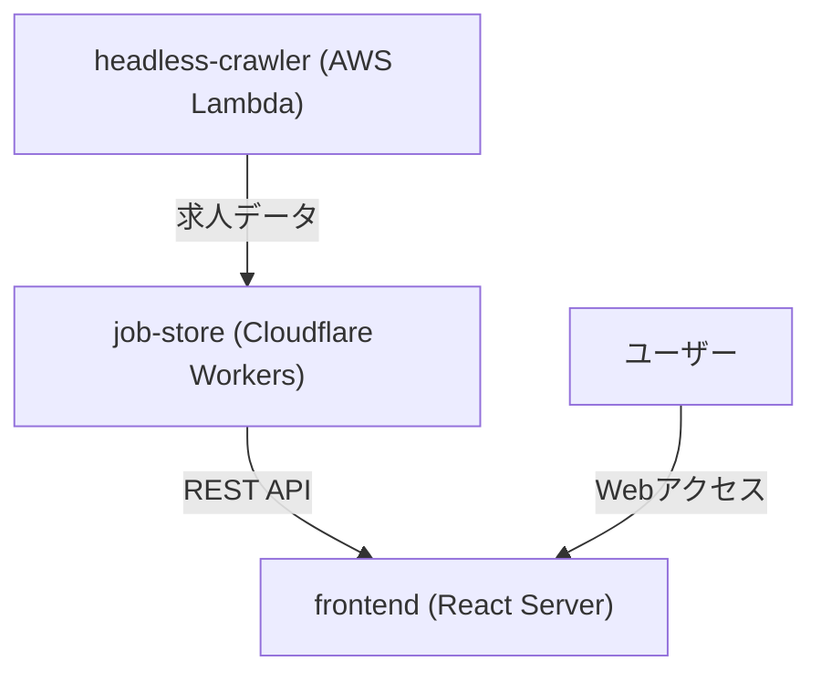

# Hello Work Searcher ポートフォリオ詳細解説

## 概要

Hello Work Searcherは、ハローワークの求人情報を自動収集・管理・検索できるモノレポ型Webアプリケーションです。クローラー、API/DB、フロントエンドを独立したパッケージとして構成し、クラウドネイティブな設計・TypeScriptによる型設計を徹底しています。

---

## 作成動機

ハローワークでソフトウェアの求人検索をしたかったが、
- 画面が見づらい
- 求人の重複が多すぎる
- 従業員数で絞り込みができない
- キーワード検索が貧弱
といった課題があり、それを自分で解決したいと考えたのが出発点です。

---

## システム全体設計図



---

## 技術選定・設計思想

- **モノレポ構成**: パッケージ間の型共有・開発効率化
- **TypeScript徹底**: 全パッケージでstrictな型安全性を担保。極力型設計を志向し、DB/API/UI間で型の一貫性を保つ。
- **クラウドネイティブ**: CrawlerはAWS Lambda、APIはCloudflare Workersでサーバーレス運用
- **関数型プログラミング**: effect-ts等を活用し副作用管理・堅牢性向上
- **自動化**: git hookでコミット時のlint、フォーマット、型チェックを自動化

---

## パッケージ詳細

### 1. headless-crawler
- **役割**: ハローワーク求人情報の自動クローリング・スクレイピング
- **主な技術**: Playwright, AWS Lambda, effect-ts
- **設計ポイント**:
  - スクレイピング対象の動的ページに対応
  - AWS Lambdaでのスケーラブルなバッチ処理
  - スキーマバリデーションでデータ品質担保
- **工夫点**:
  - 最初はCloudflareで軽量なパーサーを使ってクローリングしようとしたが、ハローワークはセッションの関係かfetchができず、headless-browser（Playwright）で遠回りする必要があった
  - クローリングでまず求人番号だけを取得し、それをSQSで渡し、SQS経由でスクレイパーを呼び出す。セッションの関係で、スクレイピングでもあらためてheadless-browserを立ち上げて、求人詳細画面まで遷移している。
  - クローリング時、ページングが早すぎるとエラーになるため、ページ遷移前に3秒遅延を入れている
  - SQS連携による非同期ジョブ投入
  - スクレイピング失敗時のリトライ・エラーハンドリング

### 2. job-store
- **役割**: 求人情報の保存・API提供
- **主な技術**: Cloudflare Workers, Drizzle ORM, Hono, D1(SQLite), Chanfana
- **設計ポイント**:
  - サーバーレスで低コスト・高可用性
  - Drizzle ORMで型安全なDB操作
  - OpenAPI自動生成でAPI仕様の一元管理
- **現状の機能**:
  - 求人情報の保存API（取得APIは今後実装予定）
  - ページネーション設計済み
- **工夫点**:
  - drizzleでDBスキーマの型を持ち、openapiと整合性を常に持たせたかった
  - Cloudflare D1の制約を考慮した設計

### 3. frontend
- **役割**: 求人情報の検索・表示UI
- **主な技術**: React Server (@lazarv/react-server), React 19, TypeScript
- **設計ポイント**:
  - サーバーコンポーネントによる高速描画
  - API型とUI型の齟齬を最小化
  - シンプルなCSS設計
- **工夫点**:
  - Job詳細・一覧の再利用可能なコンポーネント設計
  - next.jsは小さなWebアプリとしては不必要な機能が多く、remixは非同期コンポーネントの扱い方が好みでなかったため、react-server+react19で構築。ファイルベースルーティングとreact 19 api(use)を活用したかった。
  - クラウドAPIとの疎結合

---

## データフロー詳細

1. **クローリング**: headless-crawlerがハローワークWebから求人データを取得
2. **データ送信**: AWS LambdaからCloudflare Workers(job-store)へREST APIで送信
3. **保存**: job-storeがD1(SQLite)にデータを保存
4. **API提供**: frontendがjob-storeのAPIを叩き、求人情報を取得・表示（今後実装）

---

## 設計思想・工夫点まとめ
- **型安全性**: Zod/Chanfana/Drizzleで型の一貫性を担保
- **スケーラビリティ**: サーバーレスアーキテクチャでコスト最適化
- **自動化**: git hookによる型チェック・lint・フォーマット
- **保守性**: モノレポで依存管理・パッケージ分割
- **今後の展望**:
  - 求人情報の検索・取得APIの実装
  - フロントエンドのUI/UX強化（よりリッチな検索・表示機能）

---

## 参考: ディレクトリ構成

```
hello-work-searcher/
├── packages/
│   ├── schema/          # 共通スキーマ定義
│   ├── headless-crawler/ # クローラー
│   ├── job-store/       # DB・API
│   └── frontend/       # フロントエンド
├── pnpm-workspace.yaml # モノレポ設定
└── README.md           # プロジェクト概要
``` 