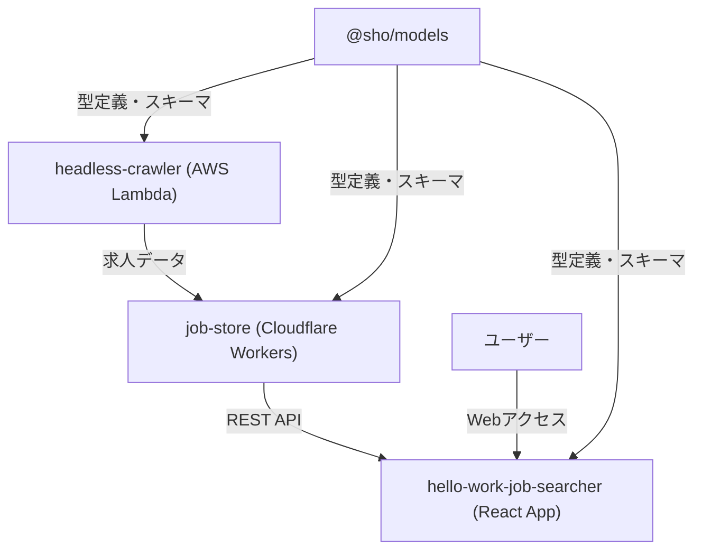

# Hello Work Searcher ポートフォリオ詳細解説

## 概要

Hello Work
Searcherは、ハローワークの求人情報を自動収集・管理・検索できるモノレポ型Webアプリケーションです。クローラー、API/DB、フロントエンドを独立したパッケージとして構成し、クラウドネイティブな設計・TypeScriptによる型設計を徹底しています。

---

## 作成動機

ハローワークでソフトウェアの求人検索をしたかったが、

- 画面が見づらい
- 求人の重複が多すぎる
- 従業員数で絞り込みができない
- キーワード検索が貧弱
  といった課題があり、それを自分で解決したいと考えたのが出発点です。

---

## システム全体設計図



---

## 技術選定・設計思想

- **モノレポ構成**: pnpm workspaceによるパッケージ間の型共有・開発効率化
- **TypeScript徹底**:
  全パッケージでstrictな型安全性を担保。極力型設計を志向し、DB/API/UI間で型の一貫性を保つ。
- **クラウドネイティブ**: CrawlerはAWS Lambda、APIはCloudflare
  Workersでサーバーレス運用
- **関数型プログラミング**: Effect-tsを活用し副作用管理・堅牢性向上
- **自動化**: Biome + Huskyでコミット時のlint、フォーマット、型チェックを自動化
- **モダンツールチェーン**:
  Biome（高速フォーマッター）、Vite（高速ビルド）、TanStack（モダンReact）

---

## パッケージ詳細

### 1. @sho/models

- **役割**: 全パッケージ共通の型定義・スキーマ管理
- **主な技術**: TypeScript, Zod, Drizzle ORM
- **設計ポイント**:
  - 型の一元管理でパッケージ間の整合性担保
  - Zodによるランタイムバリデーション
  - Drizzle ORMによるDB型定義
- **工夫点**:
  - フロントエンド、API、DB間で型の齟齬を完全に排除
  - スキーマ変更時の影響範囲を明確化

### 2. headless-crawler

- **役割**: ハローワーク求人情報の自動クローリング・スクレイピング
- **主な技術**: Playwright, AWS Lambda, AWS CDK, Effect-ts, Jest
- **設計ポイント**:
  - スクレイピング対象の動的ページに対応
  - AWS Lambdaでのスケーラブルなバッチ処理
  - スキーマバリデーションでデータ品質担保
- **工夫点**:
  - 最初はCloudflareで軽量なパーサーを使ってクローリングしようとしたが、ハローワークはセッションの関係かfetchができず、headless-browser（Playwright）で遠回りする必要があった
  - クローリングでまず求人番号だけを取得し、それをSQSで渡し、SQS経由でスクレイパーを呼び出す。セッションの関係で、スクレイピングでもあらためてheadless-browserを立ち上げて、求人詳細画面まで遷移している。
  - クローリング時、ページングが早すぎるとエラーになるため、ページ遷移前に3秒遅延を入れている
  - SQS連携による非同期ジョブ投入
  - スクレイピング失敗時のリトライ・エラーハンドリング
  - AWS CDKによるインフラコード管理

### 3. job-store

- **役割**: 求人情報の保存・API提供
- **主な技術**: Cloudflare Workers, Drizzle ORM, Hono, D1(SQLite), Chanfana,
  Effect-ts, Vitest
- **設計ポイント**:
  - サーバーレスで低コスト・高可用性
  - Drizzle ORMで型安全なDB操作
  - Chanfanaによる自動OpenAPI生成でAPI仕様の一元管理
  - HonoによるモダンなWebフレームワーク
- **現状の機能**:
  - 求人情報の保存・取得API
  - JWTベースのページネーション機能
  - RESTful API提供（求人一覧・詳細取得）
  - OpenAPI仕様書自動生成
- **工夫点**:
  - drizzleでDBスキーマの型を持ち、openapiと整合性を常に持たせたかった
  - Cloudflare D1の制約を考慮した設計
  - Effect-tsによる堅牢なエラーハンドリング
  - JWTを使用したセキュアなページネーション実装

### 4. hello-work-job-searcher (apps/)

- **役割**: 求人情報の検索・表示UI
- **主な技術**: React 19, TanStack Router, TanStack Start, Vite, TypeScript,
  Cloudflare Workers
- **設計ポイント**:
  - TanStack Startによるフルスタックフレームワーク
  - TanStack Routerによるタイプセーフなルーティング
  - React 19の最新機能活用
  - Cloudflare Workersへのデプロイ対応
- **現在の状況**:
  - モックデータを使用した基本的な表示機能
  - UIは未完成（バックエンド構築を優先中）
  - 求人検索・表示の基本機能を実装中
- **工夫点**:
  - Job詳細・一覧の再利用可能なコンポーネント設計
  - Next.jsは小さなWebアプリとしては不必要な機能が多く、RemixはReact
    19との相性を考慮し、TanStack Startを選択
  - ファイルベースルーティングとReact 19の最新機能を活用
  - クラウドAPIとの疎結合

### 5. scripts

- **役割**: 共通スクリプト・ユーティリティ
- **主な技術**: TypeScript, tsup
- **機能**: スキーマコピー等の開発支援スクリプト

---

## データフロー詳細

1. **クローリング**: headless-crawlerがハローワークWebから求人データを取得
2. **データ送信**: AWS LambdaからCloudflare Workers(job-store)へREST APIで送信
3. **保存**: job-storeがD1(SQLite)にデータを保存
4. **API提供**:
   hello-work-job-searcherがjob-storeのAPIを叩き、求人情報を取得・表示（実装中）

---

## 開発環境・ツールチェーン

### パッケージ管理

- **pnpm workspace**: モノレポ管理、高速インストール
- **依存関係の最適化**: 共通依存関係の重複排除

### 開発ツール

- **Biome**: 高速なlinter・formatter（ESLint + Prettierの代替）
- **Husky + lint-staged**: Git hooks による自動品質チェック
- **TypeScript**: 全パッケージで厳密な型チェック
- **Renovate**: 依存関係の自動更新

### テスト・品質管理

- **Jest**: headless-crawlerのテスト
- **Vitest**: job-storeのテスト
- **型チェック**: 全パッケージでの厳密な型安全性

---

## 設計思想・工夫点まとめ

### 型安全性の徹底

- **@sho/models**: 全パッケージ共通の型定義
- **Zod/Chanfana/Drizzle**: スキーマ駆動開発による型の一貫性担保
- **TypeScript strict mode**: 全パッケージで厳密な型チェック

### スケーラビリティ・運用性

- **サーバーレスアーキテクチャ**: AWS Lambda + Cloudflare Workersでコスト最適化
- **インフラコード管理**: AWS CDKによるIaC
- **自動化**: CI/CDパイプライン、依存関係更新の自動化

### 開発体験の向上

- **モノレポ**: パッケージ間の依存管理・型共有
- **モダンツールチェーン**: Biome、Vite、TanStackによる高速開発
- **関数型プログラミング**: Effect-tsによる副作用管理・エラーハンドリング

### 今後の展望

- **フロントエンド完成**: job-store APIとの連携、UI/UX強化
- **高度な検索機能**: より柔軟な求人検索・フィルタリング
- **パフォーマンス最適化**: キャッシュ戦略、レスポンス時間改善
- **監視・ログ**: 本格運用に向けた監視体制構築

---

## 参考: ディレクトリ構成

```
hello-work-searcher/
├── apps/
│   └── hello-work-job-searcher/ # フロントエンドアプリケーション
├── packages/
│   ├── models/          # 共通スキーマ・型定義
│   ├── headless-crawler/ # ハローワーククローラー
│   ├── job-store/       # 求人情報データベース・API
│   └── scripts/         # 共通スクリプト
├── pnpm-workspace.yaml # モノレポ設定
├── biome.json          # コードフォーマッター設定
├── renovate.json       # 依存関係自動更新設定
└── README.md           # プロジェクト概要
```

---

## 技術的チャレンジ・学習ポイント

### 1. モノレポ設計

- pnpm workspaceによる効率的なパッケージ管理
- 型定義の共有とパッケージ間依存関係の最適化

### 2. サーバーレスアーキテクチャ

- AWS Lambda + Cloudflare Workersのハイブリッド構成
- 各プラットフォームの特性を活かした適材適所の技術選択

### 3. 型安全性の追求

- フロントエンド〜バックエンド〜DBまでの一貫した型管理
- ランタイムバリデーションとコンパイル時型チェックの両立

### 4. モダンフロントエンド

- React 19 + TanStack Startによる最新技術スタックの採用
- ファイルベースルーティングとタイプセーフなナビゲーション

### 5. 関数型プログラミング

- Effect-tsによる副作用管理と堅牢なエラーハンドリング
- 関数型パラダイムによるコードの可読性・保守性向上
