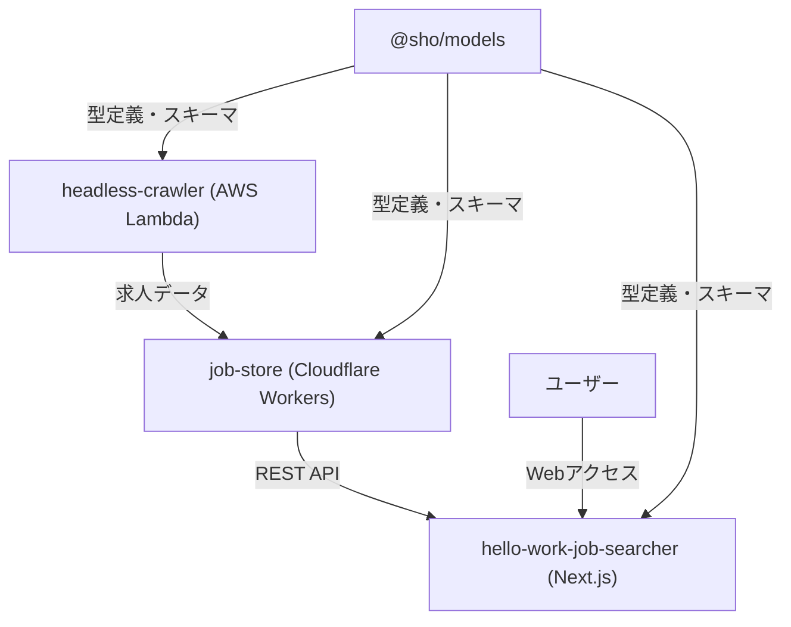

# Hello Work Searcher

求人情報の自動収集・管理システム

**🌐 デモサイト**: https://my-hello-work-job-list-hello-work-j.vercel.app/

## 概要

このプロジェクトは、ハローワークの求人情報を自動的にクロール・スクレイピングし、管理・検索できるシステムです。モノレポ構成で、フロントエンド、データベース・API、クローラーなどの各機能を独立したパッケージとして管理しています。

## アーキテクチャ

### 全体構成

```
hello-work-searcher/
├── apps/
│   └── hello-work-job-searcher/ # フロントエンドアプリケーション (Next.js 15)
├── packages/
│   ├── models/          # 共通スキーマ・型定義
│   ├── headless-crawler/ # ハローワーククローラー (AWS Lambda)
│   ├── job-store/       # 求人情報データベース・API (Cloudflare Workers)
│   └── scripts/         # 共通スクリプト・ユーティリティ
├── pnpm-workspace.yaml # モノレポ設定
├── biome.json         # コードフォーマッター設定
└── renovate.json      # 依存関係自動更新設定
```

### データフロー



### 技術スタック

#### 共通

- **パッケージマネージャー**: pnpm (workspace)
- **言語**: TypeScript
- **コードフォーマッター**: Biome
- **Git Hooks**: Husky + lint-staged
- **依存関係管理**: Renovate

#### 各パッケージ

##### `@sho/models`

- **目的**: 共通の型定義とスキーマ
- **技術**:
  - Zod (スキーマバリデーション)
  - Drizzle ORM (データベーススキーマ)
  - TypeScript (型定義)
  - tsup (ビルドツール)

##### `headless-crawler`

- **目的**: ハローワークサイトのクローリング・スクレイピング
- **技術**:
  - Playwright (ブラウザ自動化)
  - AWS CDK (インフラ管理)
  - Effect (関数型プログラミング)
  - Jest (テスト)
  - AWS Lambda + SQS (実行環境)
- **機能**:
  - 求人検索条件に基づく求人一覧取得
  - 個別求人詳細情報のスクレイピング
  - SQS連携による非同期ジョブ処理

##### `job-store`

- **目的**: 求人情報のデータベース管理・API提供
- **技術**:
  - Cloudflare Workers
  - Drizzle ORM
  - Hono (Webフレームワーク)
  - D1 (SQLite)
  - Chanfana (OpenAPI生成)
  - Effect (関数型プログラミング)
  - Vitest (テスト)
- **機能**:
  - 求人情報の保存・取得
  - JWTベースのページネーション機能
  - RESTful API提供（求人一覧・詳細取得）
  - OpenAPI仕様書自動生成

##### `hello-work-job-searcher`

- **目的**: ユーザーインターフェース
- **技術**:
  - React 19
  - Next.js 15 (App Router)
  - TypeScript
  - Turbopack (開発時高速化)
- **デプロイ**: Vercel
- **現在の状況**:
  - モックデータを使用した基本的な表示機能
  - 求人検索・表示の基本機能を実装中
  - UIコンポーネントの構築中

##### `@sho/scripts`

- **目的**: 共通スクリプト・ユーティリティ
- **技術**:
  - TypeScript
  - fs-extra (ファイル操作)
  - neverthrow (エラーハンドリング)
  - find-up (ファイル検索)
- **機能**:
  - スキーマコピー等の開発支援スクリプト

## 開発環境セットアップ

### 前提条件

- Node.js (推奨: 最新LTS版)
- pnpm (v10.14.0以上)
- AWS CLI (headless-crawler使用時)
- Cloudflare Wrangler (job-store使用時)

### インストール

```bash
# 依存関係のインストール
pnpm install

# 型チェック
pnpm type-check

# コードフォーマット
pnpm exec biome check --fix
```

### 各パッケージの開発

#### フロントエンド

```bash
cd apps/hello-work-job-searcher
pnpm dev
```

#### クローラー

```bash
cd packages/headless-crawler
pnpm verify:crawler  # クローラー動作確認
pnpm verify:scraper  # スクレイパー動作確認
pnpm type-check      # 型チェック
pnpm test           # テスト実行
```

#### データベース・API

```bash
cd packages/job-store
pnpm dev      # ローカル開発サーバー
pnpm test     # テスト実行
pnpm build    # ビルド
```

#### 共通モデル

```bash
cd packages/models
pnpm build    # 型定義・スキーマのビルド
```

## デプロイ

### クローラー (AWS)

```bash
cd packages/headless-crawler
pnpm bootstrap      # 初回のみ（CDK Bootstrap）
pnpm deploy         # AWS Lambda + SQSにデプロイ
```

### データベース・API (Cloudflare)

```bash
cd packages/job-store
pnpm deploy         # Cloudflare Workersにデプロイ
```

### フロントエンド (Vercel)

```bash
cd apps/hello-work-job-searcher
pnpm build
pnpm start          # 本番環境での起動確認
```

**デプロイ済みURL**: https://my-hello-work-job-list-hello-work-j.vercel.app/

## 主要機能

### 完成済み

- 求人検索条件に基づく自動クローリング
- 求人詳細情報の自動スクレイピング
- 求人情報のデータベース管理（`job-store`によるAPI提供）
- JWTベースのページネーション機能付き求人一覧API
- OpenAPI仕様書の自動生成
- 基本的なWeb UI（デモサイトで確認可能）

### 開発中

- 求人検索・フィルタリング機能（モックデータで基本機能実装中）
- レスポンシブなWeb UI（UIは未完成、バックエンド構築を優先中）

### 今後の予定

- フロントエンドと`job-store` APIの連携
- UIの改善・完成
- 高度な検索・フィルタリング機能
- 認証・認可機能の実装

## 技術的特徴

### 型安全性の徹底

- 全パッケージでTypeScript strict modeを有効化
- Zodによるランタイムバリデーション
- Drizzle ORMによる型安全なDB操作
- フロントエンド〜バックエンド〜DBまでの一貫した型管理

### モダンな開発体験

- pnpm workspaceによるモノレポ管理
- Biomeによる高速なlint・format
- Huskyによる自動品質チェック
- Renovateによる依存関係自動更新

### 関数型プログラミング

- Effect-tsによる副作用管理
- 堅牢なエラーハンドリング
- 関数の合成による可読性向上

### サーバーレスアーキテクチャ

- AWS Lambda（重い処理）とCloudflare Workers（軽量API）の使い分け
- コスト最適化されたスケーラブルな設計
- インフラコード（AWS CDK）による管理

## 開発ガイドライン

- TypeScriptの厳密な型チェックを有効化
- Biomeによるコードフォーマット統一
- Effectを使用した関数型プログラミング
- エラーハンドリングの徹底
- テスト駆動開発の推奨

## プロジェクト構成詳細

詳細な技術解説・設計思想については [PORTFOLIO_DETAIL.md](./PORTFOLIO_DETAIL.md)
を参照してください。

## ライセンス

ISC
