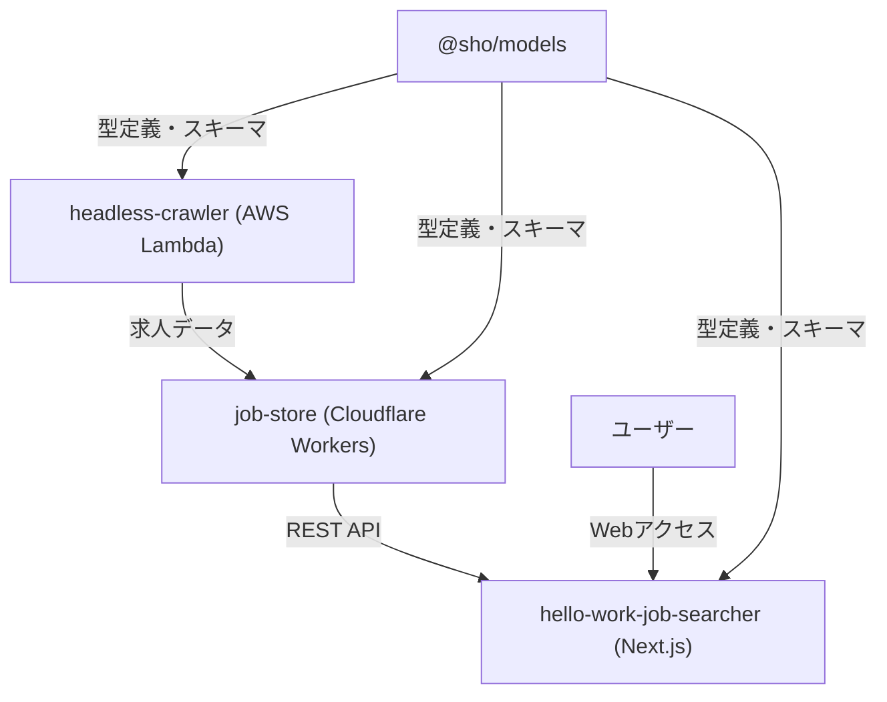

# Hello Work Software Jobs

求人情報の自動収集・管理システム

**🌐 デモサイト**: https://my-hello-work-job-list-hello-work-j.vercel.app/

## 🚀 TL;DR（斜め読み用サマリー）

**何をするプロジェクト？**\
ハローワークのソフトウェア関連求人情報を自動収集・管理・検索できるWebアプリケーション

**技術スタック**\
TypeScript + neverthrow + AWS Lambda + Cloudflare Workers + Next.js 15 + React 19

**アーキテクチャ**\
モノレポ型サーバーレス構成（コスト最適化重視）

**実績**\
約600件の求人データを自動収集・構造化、手動検索プロセスを完全自動化

**技術的ハイライト**

- ✨ 型主導開発による堅牢性・neverthrowによる関数型エラーハンドリング
- 🏗️ AWS Lambda + Cloudflare Workersのハイブリッド構成
- 🔒 Drizzle ORM + Zod + TypeScriptによる一貫した型管理
- 📦 pnpm workspaceによるモノレポ管理
- 🚀 React 19 + Next.js 15の最新技術スタック

**5分で理解する構成**

```
クローラー(AWS Lambda) → API/DB(Cloudflare Workers) → フロントエンド(Next.js/Vercel)
```

---

## プロジェクトの目的・背景

このプロジェクトは以下の3つの目的で開発されました：

### 1. 🎯 ポートフォリオとしての技術力アピール
- モダンなTypeScript技術スタックの習得・実践
- サーバーレスアーキテクチャの設計・実装経験
- 型主導開発による堅牢なシステム構築の実証

### 2. 🚀 行政オープンデータ活用の個人プロジェクト基盤
- 今後、行政が提供するオープンデータを活用した便利なアプリケーション開発の足がかり
- 公共データの構造化・可視化技術の習得
- 社会課題解決に向けた技術的アプローチの実践

### 3. 💡 ハローワーク求人検索の課題解決
現在のハローワークのソフトウェア求人検索には以下の問題があります：
- **同一企業の求人乱立**: 同じ会社が複数の求人を出しており、検索結果が見づらい
- **業態の不明確さ**: SES、受託開発、自社開発の区別がぱっと見でわからない
- **従業員数での絞り込み困難**: 会社規模による検索・フィルタリング機能が不十分
- **一時保存機能の不備**: 気になる求人を保存・比較する機能がなく、振り返りができず不便
- **URL共有不可**: セッションでページ管理されているため、URLで求人情報を共有できない

これらの課題を解決し、より使いやすい求人検索体験を提供することを目指しています。

## 概要

このプロジェクトは、ハローワークの求人情報を自動的にクロール・スクレイピングし、管理・検索できるシステムです。モノレポ構成で、フロントエンド、データベース・API、クローラーなどの各機能を独立したパッケージとして管理しています。

## アーキテクチャ

### 全体構成

```
hello-work-software-jobs/
├── apps/
│   └── hello-work-job-searcher/ # フロントエンドアプリケーション (Next.js 15)
├── packages/
│   ├── models/          # 共通スキーマ・型定義 (@sho/models)
│   ├── headless-crawler/ # ハローワーククローラー (AWS Lambda)
│   ├── job-store/       # 求人情報データベース・API (Cloudflare Workers)
│   └── scripts/         # 共通スクリプト・ユーティリティ (@sho/scripts)
├── pnpm-workspace.yaml # モノレポ設定
├── biome.json         # コードフォーマッター設定
└── renovate.json      # 依存関係自動更新設定
```

### データフロー



### 技術スタック

#### 共通

- **パッケージマネージャー**: pnpm (v10.14.0)
- **言語**: TypeScript (v5.8.3)
- **コードフォーマッター**: Biome (v2.0.6)
- **Git Hooks**: Husky (v9.1.7) + lint-staged (v16.1.0)
- **依存関係管理**: Renovate
- **コミット規約**: Commitlint (v19.8.1)

#### 各パッケージ

##### `@sho/models`

- **目的**: 共通の型定義とスキーマ（Source of Truth）
- **技術**:
  - Zod (v3.25.74) - スキーマバリデーション
  - Drizzle ORM (v0.44.2) - データベーススキーマ
  - TypeScript (v5.8.3) - 型定義
  - tsup (v8.5.0) - ビルドツール
  - Playwright (v1.53.1) - テスト用ブラウザ自動化
  - @asteasolutions/zod-to-openapi (v7.2.0) - OpenAPI仕様生成

##### `headless-crawler`

- **目的**: ハローワークサイトのクローリング・スクレイピング
- **技術**:
  - Playwright (v1.53.1) - ブラウザ自動化
  - AWS CDK (v2.1025.0) - インフラ管理
  - Effect (v3.16.5) - 関数型プログラミング（**今後neverthrowに移行予定**）
  - AWS Lambda + SQS - 実行環境
  - @sparticuz/chromium (v138.0.0) - Lambda用Chromium
  - @aws-sdk/client-sqs (v3.840.0) - SQS連携
  - esbuild (v0.25.5) - ビルドツール
  - Zod (v3.25.74) - スキーマバリデーション
- **機能**:
  - 求人検索条件に基づく求人一覧取得
  - 個別求人詳細情報のスクレイピング
  - SQS連携による非同期ジョブ処理
  - EventBridge (Cron) による定期実行（毎週月曜日午前1時）
  - CloudWatch アラーム機能付き

##### `job-store`

- **目的**: 求人情報のデータベース管理・API提供
- **技術**:
  - Cloudflare Workers - 実行環境
  - Drizzle ORM (v0.44.2) - データベースORM
  - Hono (v4.8.3) - Webフレームワーク
  - D1 (SQLite) - データベース
  - Chanfana (v2.8.1) - OpenAPI生成
  - Vitest (v3.2.0) - テスト
  - Zod (v3.25.74) - バリデーション
  - neverthrow (v8.2.0) - エラーハンドリング
  - Wrangler (v4.26.1) - デプロイメントツール
  - tsup (v8.5.0) - ビルドツール
  - @hono/zod-openapi (v1.0.2) - OpenAPI統合
  - @hono/zod-validator (v0.7.2) - Zodバリデーション統合
  - valibot (v1.1.0) - 追加バリデーション
  - dotenv (v17.0.0) - 環境変数管理
  - hono-openapi (v0.4.8) - OpenAPI拡張
- **機能**:
  - 求人情報の保存・取得
  - JWTベースのページネーション機能
  - RESTful API提供（求人一覧・詳細取得）
  - OpenAPI仕様書自動生成 (`/api/v1/docs`)
  - ルートパスから自動的にドキュメントページへリダイレクト
  - 主要エンドポイント:
    - `POST /api/v1/job` - 求人情報登録
    - `GET /api/v1/job/:jobNumber` - 求人詳細取得
    - `GET /api/v1/jobs` - 求人一覧取得（会社名フィルタリング対応）
    - `GET /api/v1/jobs/continue` - 継続ページネーション（JWTトークンベース）

##### `hello-work-job-searcher`

- **目的**: ユーザーインターフェース
- **技術**:
  - React (v19.1.1)
  - Next.js (v15.4.7) - App Router
  - TypeScript (v5)
  - Turbopack - 開発時高速化
  - TanStack React Virtual (v3.13.12) - 仮想化による無限スクロール
  - neverthrow (v8.2.0) - エラーハンドリング
  - Jotai (v2.13.1) - 状態管理
- **デプロイ**: Vercel
- **実装済み機能**:
  - ✅ 求人一覧表示（無限スクロール対応）
  - ✅ 求人詳細ページ
  - ✅ 高度な検索・フィルタリング機能
    - 会社名検索（リアルタイム）
    - 職務内容キーワード検索
    - 除外キーワード検索
    - 従業員数範囲フィルタ（1-9人、10-30人、30-100人、100人以上）
  - ✅ お気に入り機能（ブラウザに保存）
  - ✅ お気に入り求人の一覧表示・管理

##### `@sho/scripts`

- **目的**: 共通スクリプト・ユーティリティ
- **技術**:
  - TypeScript (v5.8.3)
  - neverthrow (v8.2.0) - エラーハンドリング
  - tsx (v4.20.3) - TypeScript実行環境
- **機能**:
  - スキーマコピー等の開発支援スクリプト (`copy-schema`)

## 開発環境セットアップ

### 前提条件

- Node.js (推奨: 最新LTS版)
- pnpm (v10.14.0以上)
- AWS CLI (headless-crawler使用時)
- Cloudflare Wrangler (job-store使用時)

### インストール

```bash
# 依存関係のインストール
pnpm install

# 型チェック
pnpm type-check

# コードフォーマット
pnpm exec biome check --fix
```

### 各パッケージの開発

#### フロントエンド

```bash
cd apps/hello-work-job-searcher
pnpm dev  # http://localhost:9002 で起動
```

#### クローラー

```bash
cd packages/headless-crawler
pnpm verify:crawler  # クローラー動作確認
pnpm verify:scraper  # スクレイパー動作確認
pnpm type-check      # 型チェック
```

#### データベース・API

```bash
cd packages/job-store
pnpm dev      # ローカル開発サーバー
pnpm test     # テスト実行
pnpm build    # ビルド
```

#### 共通モデル

```bash
cd packages/models
pnpm build    # 型定義・スキーマのビルド
```

## デプロイ

### クローラー (AWS)

**前提条件**: Nix環境が必要です

```bash
cd packages/headless-crawler
nix-shell           # Nix環境に入る
pnpm bootstrap      # 初回のみ（CDK Bootstrap）
pnpm run deploy     # AWS Lambda + SQSにデプロイ
```

### データベース・API (Cloudflare)

```bash
cd packages/job-store
pnpm deploy         # Cloudflare Workersにデプロイ
```

### フロントエンド (Vercel)

```bash
cd apps/hello-work-job-searcher
pnpm build
pnpm start          # 本番環境での起動確認
```

**デプロイ済みURL**: https://my-hello-work-job-list-hello-work-j.vercel.app/

## 主要機能

### 完成済み

- ✅ ハローワーク求人の自動収集（毎週月曜日午前1時に実行）
- ✅ 求人一覧表示（無限スクロール対応）
- ✅ 求人詳細表示
- ✅ 高度な検索・フィルタリング機能
  - 会社名検索（リアルタイム）
  - 職務内容キーワード検索
  - 除外キーワード検索
  - 従業員数範囲フィルタ（1-9人、10-30人、30-100人、100人以上）
- ✅ お気に入り機能（ブラウザに保存）
- ✅ お気に入り求人の一覧表示・管理
- ✅ レスポンシブなWeb UI
- ✅ 求人情報のURL共有機能

### 開発中・今後の予定

- 🔄 Effect-tsからneverthrowへの移行（実装の複雑さ軽減のため）
- 🔄 UIの改善・完成
- 📋 事業形態タグ機能（SES、受託開発、自社開発の分類）
- 📋 プログラミング言語タグ機能（使用技術の分類・フィルタリング）
- 📋 企業ごとの求人まとまり機能（同一企業の求人をグループ化）
- 📋 求人アラート機能
- 📋 検索条件の保存・復元機能

## 技術的特徴

### 型主導開発

- **@sho/models**をSource of Truthとした一貫した型管理
- 全パッケージでTypeScript strict modeを有効化
- Zodによるランタイムバリデーション
- Drizzle ORMによる型安全なDB操作
- フロントエンド〜バックエンド〜DBまでの型の一貫性

### モダンな開発体験

- pnpm workspaceによるモノレポ管理
- Biomeによる高速なlint・format
- Huskyによる自動品質チェック
- Renovateによる依存関係自動更新
- Turbopackによる高速な開発サーバー
- Commitlintによるコミット規約の統一

### 関数型エラーハンドリング

- neverthrowによる堅牢なエラーハンドリング
- 実装の複雑さを抑えつつ型安全性を確保
- Effect-tsから段階的に移行中（実用性重視）

### サーバーレスアーキテクチャ

- AWS Lambda（重い処理）とCloudflare Workers（軽量API）の使い分け
- コスト最適化されたスケーラブルな設計
- インフラコード（AWS CDK）による管理
- EventBridge による定期実行
- CloudWatch アラーム機能

### パフォーマンス最適化

- ハイブリッドデータフェッチング（SSR + クライアントサイド）による初期表示高速化
- TanStack React Virtual による大量データの仮想化と無限スクロール
- JWTベースのページネーション（15分有効期限、カーソルベース）
- プロキシAPIによるCORS回避とエラーハンドリング
- Jotaiによる効率的な状態管理（jobListAtom, JobOverviewListAtom）
- 仮想化によるスクロール位置保持とメモリ効率化
- neverthrowによる型安全なエラーハンドリング

## API仕様

### job-store API

- **ベースURL**: 環境変数 `JOB_STORE_ENDPOINT` で設定
- **OpenAPI仕様書**: `{BASE_URL}/api/v1/docs`

#### エンドポイント

- `POST /api/v1/job` - 求人情報登録
- `GET /api/v1/job/:jobNumber` - 求人詳細取得
- `GET /api/v1/jobs?companyName={name}&jobDescription={keyword}&jobDescriptionExclude={exclude}&employeeCountGt={min}&employeeCountLt={max}` - 求人一覧取得（高度なフィルタリング対応）
- `GET /api/v1/jobs/continue?nextToken={token}` - 継続ページネーション（JWTトークンベース、15分有効期限）

#### プロキシAPI（フロントエンド）

- `GET /api/proxy/job-store/jobs?companyName={name}&jobDescription={keyword}&jobDescriptionExclude={exclude}&employeeCountGt={min}&employeeCountLt={max}` - 求人一覧取得プロキシ（高度なフィルタリング対応）
- `GET /api/proxy/job-store/jobs/continue?nextToken={token}` - 継続ページネーションプロキシ

## 開発ガイドライン

- TypeScriptの厳密な型チェックを有効化
- Biomeによるコードフォーマット統一
- neverthrowによるエラーハンドリングの徹底
- @sho/modelsを中心とした型主導開発
- テスト駆動開発の推奨
- Conventional Commitsによるコミットメッセージ規約

## プロジェクト構成詳細

詳細な技術解説・設計思想については [PORTFOLIO_DETAIL.md](./PORTFOLIO_DETAIL.md)
を参照してください。

## ライセンス

ISC
